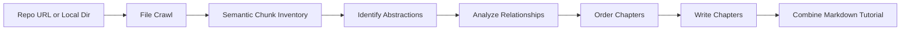

# AI Codebase Tutorial Builder

Turn a GitHub repository or local codebase into a beginner-friendly Markdown tutorial.

This repository is a Pocket Flow based CLI pipeline. The current implementation crawls source files, builds semantic code chunks, asks an LLM to identify the main abstractions, analyzes how they relate, orders the chapters, writes each chapter, and finally combines everything into a tutorial folder.


<p align="center">
  
</p>

## What the current code does

- Accepts either a GitHub repository URL with `--repo` or a local directory with `--dir`
- Filters files by include patterns, exclude patterns, and a max file size
- Respects `.gitignore` when crawling a local directory
- Uses a Node.js `code-chunk` sidecar to build semantic chunks when available
- Falls back to coarse local chunks when Node.js is unavailable, so generation can still run
- Uses a multi-step LLM workflow:
  1. `FetchRepo`
  2. `IdentifyAbstractions`
  3. `AnalyzeRelationships`
  4. `OrderChapters`
  5. `WriteChapters`
  6. `CombineTutorial`
- Generates tutorials in `Chinese` by default

The current tutorial writer is tuned for beginner-friendly output: short code blocks, Mermaid diagrams, cross-chapter links, simple explanations, and analogy-heavy walkthroughs.

## Output

Running the generator creates a `pf_guide/` folder by default:

```text
pf_guide/
  index.md
  01_<chapter_name>.md
  02_<chapter_name>.md
  ...
```

`index.md` contains:

- a short project summary
- a Mermaid relationship graph
- ordered chapter links

The repository also contains previously generated examples under [`docs/`](./docs/), including:

- [`docs/Codex/index.md`](./docs/Codex/index.md)
- [`docs/FastAPI/index.md`](./docs/FastAPI/index.md)
- [`docs/PocketFlow/index.md`](./docs/PocketFlow/index.md)
- [`docs/Requests/index.md`](./docs/Requests/index.md)

## How it works



Implementation entry points:

- [`main.py`](./main.py): CLI entry and shared state setup
- [`flow.py`](./flow.py): Pocket Flow pipeline wiring
- [`nodes.py`](./nodes.py): the six pipeline nodes and prompts
- [`utils/semantic_chunks.py`](./utils/semantic_chunks.py): chunk inventory building and fallback chunking
- [`tools/code_chunk_adapter.mjs`](./tools/code_chunk_adapter.mjs): Node sidecar for `code-chunk`
- [`utils/call_llm.py`](./utils/call_llm.py): provider selection, cache, logging, telemetry

`C0de1ndex/` is present in this repository, but it is not part of the default `main.py -> flow.py -> nodes.py` execution path.

## Requirements

- Python 3.10+
- `pip`
- Recommended: Node.js 18+ and `npm`
- Recommended for SSH repository URLs: Git

Install dependencies:

```bash
pip install -r requirements.txt
npm install
```

Notes:

- Node.js is recommended, not strictly required. If `node` is not available, the Python pipeline falls back to less precise local chunks.
- `npm install` is only used for the semantic chunking sidecar through the `code-chunk` package.

## LLM configuration

Environment variables are loaded from a local `.env` file via `python-dotenv`.

### Option 1: Gemini

If either `GEMINI_PROJECT_ID` or `GEMINI_API_KEY` is set, the code automatically uses Gemini.

```bash
GEMINI_API_KEY=your_api_key
GEMINI_MODEL=gemini-2.5-pro-exp-03-25
```

For Vertex AI:

```bash
GEMINI_PROJECT_ID=your_gcp_project
GEMINI_LOCATION=us-central1
GEMINI_MODEL=gemini-2.5-pro-exp-03-25
```

### Option 2: OpenAI-compatible provider

For non-Gemini providers, the current code expects:

```bash
LLM_PROVIDER=OPENROUTER
OPENROUTER_MODEL=your_model_name
OPENROUTER_BASE_URL=https://openrouter.ai/api
OPENROUTER_API_KEY=your_api_key
```

The same shape works for other providers such as `XAI` or `OLLAMA`:

```bash
LLM_PROVIDER=OLLAMA
OLLAMA_MODEL=qwen2.5-coder:14b
OLLAMA_BASE_URL=http://localhost:11434
```

`<PROVIDER>_API_KEY` is optional for local providers such as Ollama.

### GitHub token

If you analyze private repositories, or want to reduce rate-limit issues for public ones, set:

```bash
GITHUB_TOKEN=your_github_token
```

### Verify provider setup

```bash
python utils/call_llm.py
```

## Usage

## Usage

### Deep Analysis Mode

For comprehensive, in-depth documentation, use the `--deep` flag:

```bash
python main.py --repo https://github.com/username/repo --deep
```

This mode generates **10x more detailed documentation** with:

- **Deep Abstraction Analysis**: Design motivation, trade-offs, alternatives, and improvements for each concept
- **Design Pattern Analysis**: Identification and explanation of all design patterns used
- **Architecture Overview**: Multiple Mermaid diagrams showing system architecture, data flow, and dependencies
- **Code Walkthroughs**: Line-by-line explanations of key files
- **Enhanced Chapters**: Each chapter includes origin, background, real-world examples, pitfalls, best practices, and advanced topics
- **Tutorial Synthesis**: Quick start guide, FAQ, glossary, and learning paths

### Auto Abstraction Count

By default, the `--max-abstractions` flag is set to `auto`, which lets the LLM estimate the optimal number of chapters based on project complexity (clamped between 3-12). For a fixed chapter count, pass an explicit value:

```bash
python main.py --repo https://github.com/username/repo --max-abstractions 15
```

### CLI Examples

Show CLI help:

```bash
python main.py --help
```

Analyze a public GitHub repository:

```bash
python main.py --repo https://github.com/pallets/flask
```

Analyze a branch or subdirectory URL:

```bash
python main.py --repo https://github.com/langchain-ai/langgraph/tree/main/libs/langgraph
```

Analyze an SSH repository URL:

```bash
python main.py --repo git@github.com:owner/private-repo.git --token your_github_token
```

Analyze a local directory:

```bash
python main.py --dir /path/to/codebase
```

Generate English output instead of the default Chinese:

```bash
python main.py --repo https://github.com/pallets/flask --language English
```

Use custom include and exclude filters:

```bash
python main.py --dir . --include "*.py" "*.ts" "*.md" --exclude "tests/*" "docs/*"
```

Write output somewhere else:

```bash
python main.py --repo https://github.com/pallets/flask --output generated_tutorials
```

Run the local web console:

```bash
python -m webapp.server
```

If `webapp/bin/` is missing the Windows API Code Pack DLLs on a fresh machine, install them once:

```powershell
powershell -ExecutionPolicy Bypass -File tools/install_windows_api_code_pack.ps1
```

Then open `http://127.0.0.1:8765` in your browser. The web console currently supports:

- opening the native Windows `CommonOpenFileDialog` folder picker from the `分析目录` browse button and filling the selected repository path automatically
- adding local repository analysis jobs into a queue
- deleting pending/completed/failed jobs from the queue
- setting include/exclude patterns and core analysis parameters
- defaulting output to `<selected_repo>/output`
- starting the queue and watching per-task logs and output paths

## CLI options

- `--repo`: GitHub repository URL
- `--dir`: local directory path
- `-n, --name`: override the derived project name
- `-t, --token`: GitHub token, otherwise `GITHUB_TOKEN` is used
- `-o, --output`: base output directory, default `output`
- `-i, --include`: include glob patterns
- `-e, --exclude`: exclude glob patterns
- `-s, --max-size`: max file size in bytes, default `100000`
- `--language`: tutorial language, default `Chinese`
- `--max-abstractions`: use `auto` to let the LLM estimate a suitable chapter count, or pass a positive integer to cap the number of tutorial abstractions; default `auto`
- `--no-cache`: disable prompt-level LLM response caching
- `--max-extraction-batches`: override bounded extraction batch count
- `--llm-extraction-concurrency`: override concurrent extraction workers

`--repo` and `--dir` are mutually exclusive, and one of them is required.

## Default file filters

The current defaults are intentionally conservative.

Included by default:

- source files such as `*.py`, `*.js`, `*.ts`, `*.tsx`, `*.go`, `*.java`, `*.c`, `*.cpp`
- docs and config-like files such as `*.md`, `*.rst`, `*.yaml`, `*.yml`, `*Dockerfile`, `*Makefile`

Excluded by default:

- `assets`, `images`, `public`, `static`, `temp`
- test folders and test-like files
- `docs`, `examples`, `dist`, `build`, `legacy`, `experimental`
- `.git`, `.github`, `.next`, `.vscode`, `node_modules`, virtual environments, logs

If you want to analyze a documentation-heavy repository, pay attention to the default `docs` exclusion and override it explicitly.

## Cache, logs, and tuning

The current code writes and reads these runtime artifacts:

- `llm_cache.json`: prompt-response cache
- `logs/llm_calls_YYYYMMDD.log`: raw LLM call log
- `logs/llm_metrics_YYYYMMDD.jsonl`: structured telemetry

Useful environment variables:

- `LOG_DIR`: override the log directory, default `logs`
- `LLM_HTTP_TIMEOUT`: HTTP timeout in seconds for provider calls, default `120`
- `LLM_TELEMETRY=0`: disable telemetry file writing
- `LLM_TELEMETRY_FILE`: custom telemetry file path
- `LLM_MAX_EXTRACTION_BATCHES`: default extraction batch cap, default `40`
- `LLM_EXTRACTION_CONCURRENCY`: default extraction concurrency, default `1`

The CLI flags `--max-extraction-batches` and `--llm-extraction-concurrency` override the corresponding environment defaults for a run.

## Testing

Run the current test suite with:

```bash
python -m unittest discover tests
```

The tests cover:

- CLI defaults such as the default tutorial language
- semantic chunk mapping and fallback behavior
- chunk packing and file-index extraction
- the compact abstraction-planning and refinement contract

## Docker

A minimal Dockerfile is included:

```bash
docker build -t tutorial-builder .
docker run --rm -it -e GEMINI_API_KEY=your_api_key -v "$(pwd)/output":/app/output tutorial-builder --repo https://github.com/pallets/flask
```

Important caveat:

- the current Dockerfile installs Python dependencies and Git
- it does not install Node.js or `npm`
- inside that image, semantic chunking falls back to the Python-side fallback chunks unless you extend the image yourself

## Repository layout

```text
.
├─ main.py
├─ flow.py
├─ nodes.py
├─ utils/
├─ tools/
├─ tests/
├─ docs/
└─ C0de1ndex/
```

- `docs/` contains generated example tutorials for publishing
- `tests/fixtures/` contains small polyglot fixtures for chunking tests
- `C0de1ndex/` is a separate Go-based experiment that is not called by the default Python flow

## License

MIT


