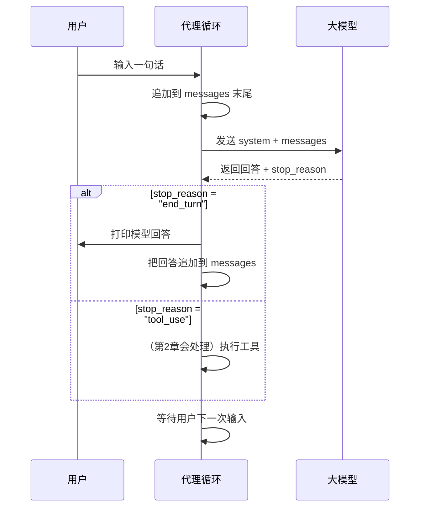

# Chapter 1: 代理循环

你好呀，欢迎来到 claw0 教程的第一站！今天我们要认识整个智能代理（Agent）最核心的部分——**代理循环**。它就像机器人的心脏，不停地跳动，驱动着整个系统运转。

读完这一章，你会理解：一个能和你多轮对话、将来还能调用工具的智能助手，是如何从一个极其简单的 `while True` 循环开始的。

---

## 从一个日常对话说起

想象一下你有一个私人助理：

1. 你跟他说：“帮我查一下今天的天气。”
2. 助理想了一下，可能直接回答“今天晴天，25℃”，也可能说“我需要打个电话查询”。
3. 如果直接回答了，你就听到了结果；如果需要打电话，他会去打，然后把结果告诉你。
4. 然后他又静静地等着你的下一个请求。

在 claw0 里，这个“助理”就是一个运行中的 Python 程序，它的运转方式完全一样：**不断接收你的输入 → 让大模型（LLM）思考 → 根据思考结果做出反应**。这个重复的过程就是“代理循环”。

---

## 代理循环长什么样？

用最简单的代码来描述，就是这样：

```python
def agent_loop():
    messages = []          # 记忆本：存下所有对话
    while True:            # 永远循环，直到你喊停
        # 1. 接收用户输入
        # 2. 调用大模型
        # 3. 根据 stop_reason 决定下一步
```

这三个步骤每轮重复一次，就构成了代理的核心骨架。不论后面给它添加多少复杂能力，这个结构都不会变，只会在此基础上“添砖加瓦”。

---

## 关键概念拆解

### 1. `messages` 数组：代理的记忆

大模型每次回答问题的时候，并不会记住上一轮说了什么。它看到的只有我们每次发给它的**全部对话历史**。这个历史就存在 `messages` 数组里，里面是一条条记录：

```python
messages = [
    {"role": "user",      "content": "法国的首都是哪里？"},
    {"role": "assistant", "content": "巴黎。"},
    {"role": "user",      "content": "那它的人口是多少？"},
]
```

每次收到新问题时，我们把它追加到 `messages` 末尾，再把整个数组发给模型。这样模型就能“记住”上下文了。

> **比喻时间**：`messages` 就好比你跟助理说话时记的会议记录。助理每次回答都要翻看之前的记录，才知道你在连续聊什么。

### 2. `stop_reason`：唯一的决策分岔口

我们把整个对话历史发给大模型后，它会返回一个回答，同时还会附带一个信号，叫做 `stop_reason`，告诉我们“它是怎么结束的”。

常见的 `stop_reason` 有三种：

| stop_reason    | 含义                      | 代理该做什么？           |
|----------------|---------------------------|--------------------------|
| `end_turn`     | 模型说完话了              | 打印回复，等待你下一句话 |
| `tool_use`     | 模型想调用一个工具        | 执行工具，并把结果喂回去 |
| `max_tokens`   | 话太长被截断了            | 可能只打印部分文本       |

在第一章里，我们还没有工具，所以只会处理 `end_turn`。但即便如此，代码里也为 `tool_use` 留好了位置，这为下一章“工具使用”铺好了路，到时候完全不用动循环结构。

### 3. `while True` 循环：永不停止的心跳

这个循环会一直运行，直到你输入 `quit` / `exit`，或者按下 `Ctrl+C` 退出。每循环一次，代理就完成一次“听→想→说（或调用工具）”的任务。

这三者加在一起，就形成了第一章里最核心的代理循环图景：



> **记住这个图**，因为整个教程后面所有功能的加入，都不会改变这个基本流程。它只是在这个骨架上穿上不同的衣服而已。

---

## 运行你的第一个代理

### 准备工作

在项目根目录下，确保已经把 API 密钥写入了 `.env` 文件：

```bash
echo 'ANTHROPIC_API_KEY=sk-ant-xxxxx' > .env
echo 'MODEL_ID=claude-sonnet-4-20250514' >> .env
```

然后用下面的命令启动：

```bash
python en/s01_agent_loop.py
```

你会看到一个提示符，直接跟它对话就行：

```
============================================================
  claw0  |  Section 01: The Agent Loop
  Model: claude-sonnet-4-20250514
  Type 'quit' or 'exit' to leave. Ctrl+C also works.
============================================================

You > 法国的首都是哪里？

Assistant: 巴黎。

You > 那它的人口是多少呢？

Assistant: 大约 216 万（截至 2024 年）。
```

注意第二个问题里，你没有再提“巴黎”两个字，但模型正确回答了。这就是 `messages` 阵列在背后默默工作的结果。

---

## 代码逐段解读

### 1. 导入库和基础配置

```python
from anthropic import Anthropic  # Anthropic API 客户端

client = Anthropic(api_key="...")  # 初始化客户端
SYSTEM_PROMPT = "你是一个乐于助人的AI助手。"  # 系统指令
```

这里我们初始化了跟大模型对话的客户端，并且设定了一句“系统提示”，告诉模型它的角色。

### 2. 循环骨架：输入、调用、分支

```python
messages = []
while True:
    user_input = input("You > ").strip()        # 1. 获取输入
    if user_input.lower() in ("quit", "exit"):
        break

    messages.append({"role": "user", "content": user_input})  # 2. 记录用户话

    response = client.messages.create(
        model=MODEL_ID, system=SYSTEM_PROMPT, messages=messages
    )  # 3. 调用模型
```

这几乎就是整个代理的本质。每一轮我们只做了三件事：收输入、追加进记忆、调用 API。

### 3. 根据 `stop_reason` 决定动作

```python
if response.stop_reason == "end_turn":
    text = response.content[0].text  # 提取文本
    print(f"Assistant: {text}")      # 打印回答
    messages.append({"role": "assistant", "content": response.content})
```

当模型正常说完话时，我们把它的回答显示出来，并且同样记录进 `messages`，方便下一轮使用。

```python
elif response.stop_reason == "tool_use":
    print("[工具调用] 本章暂未实现，敬请期待第2章。")
    messages.append({"role": "assistant", "content": response.content})
```

这里我们看到 `tool_use` 分支虽然还是“占位符”，但它表明将来只需要在这里填上工具执行的逻辑，循环的其他部分保持原样。

---

## 如何理解这个“死循环”？

可能你会担心：`while True` 听起来很危险？别怕，这里面到处是“温柔”的退出方式：

- 键盘中断（Ctrl+C）会让它优雅退出。
- 输入 `quit` 或 `exit` 也能安全结束程序。

在图形界面或真正的机器人程序里，这个循环可能换成事件循环（比如 `asyncio`），但核心的“感知 → 决策 → 行动”模式毫无二致。

---

## 总结与下一站

恭喜你！现在你已经掌握了代理系统中最重要的一根“脊梁”。我们学会了：

- **代理循环 = `while True` + `messages` 数组 + `stop_reason` 分支**
- 整个对话过程就是不断把新输入追加到记忆，调用大模型，根据返回的 `stop_reason` 做出反应。
- 这个结构固定不变，是后续所有特性的基础。

下一章，我们将迈入更激动人心的领域：[第2章：工具使用](02_工具使用.md)。在那里，你会看到当 `stop_reason` 变成 `tool_use` 时，代理如何真正“动手”帮你做事 —— 比如查询天气、计算数学式子等等。到时候你会发现，今天写的那个 `tool_use` 占位符原来如此重要。

准备好了吗？我们下一页见！

---

Generated by [AI Codebase Knowledge Builder](https://github.com/The-Pocket/Tutorial-Codebase-Knowledge)