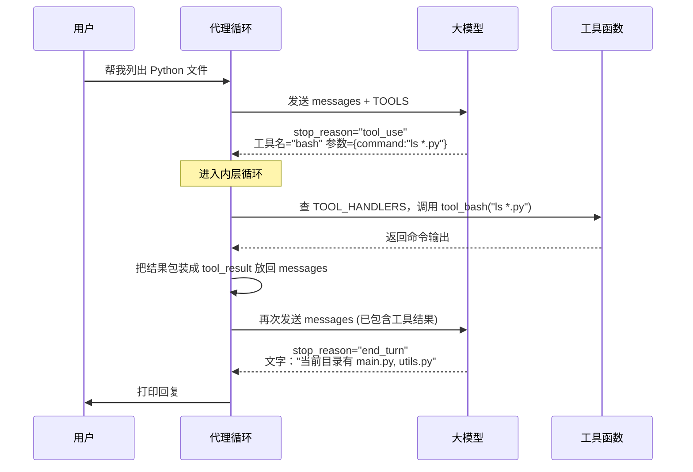

# Chapter 2: 工具使用

在[第1章：代理循环](01_代理循环.md)中，我们让代理学会了一个最基本的本事：不断接收你的输入，让大模型（LLM）思考，然后把回答打印出来。但这样的代理只是一个“只会说不会做”的聊天机器人。真正有用的助手，必须能动手帮你做事——查文件、跑命令、写文件……这就是本章的主题：**工具使用**。

读完这一章，你会理解：代理如何通过定义好的工具，从“纯对话”升级成“能动手的助手”，而且这个升级几乎不需要改动原来的循环结构。

---

## 从一次真正的工作开始

想象你给代理提了这个请求：

```
你 > 帮我看看当前目录下有哪些 Python 文件？
```

一个“只会聊天”的代理最多只能说：“抱歉，我没法访问你的文件系统。”但现在，它如果能自己运行一条 `ls *.py` 命令，然后把结果告诉你，那就强大多了。

**工具使用**做的就是这样一件事：让模型能够根据你的请求，*选择*一个可以操作外部世界的“工具”，*调用*它，把*结果*再交给模型，最终转化成一段清晰明了的自然语言回复。

---

## 核心概念：一张“菜单” + 一张“电话本”

要给模型配备工具，只需要准备两样东西。这两样东西分别回答了“有什么可以用？”和“谁来执行？”这两个问题。

### 1. `TOOLS` —— 工具的说明书

这是一份清单，告诉模型：“你好，我能帮你做这 4 件事……”每一项都是一个 JSON 格式的说明，包括名字、功能介绍，以及需要什么参数。

```python
TOOLS = [
    {
        "name": "bash",
        "description": "运行一条 Shell 命令，返回输出内容。",
        "input_schema": {
            "type": "object",
            "properties": {
                "command": {"type": "string", "description": "要执行的命令。"}
            },
            "required": ["command"],
        },
    },
    # ... 还有 read_file、write_file、edit_file 等
]
```

> **JSON Schema 是什么？** 你可以把它理解为一份“参数说明书”。比如 `bash` 这个工具需要你告诉它 `command` 这个参数（一个字符串），这样模型才知道调用时要填什么。

### 2. `TOOL_HANDLERS` —— 实际干活的函数通讯录

这是一本“通讯录”，把工具的名字（`"bash"`）直接对应到一个真的能执行命令的 Python 函数（`tool_bash`）：

```python
TOOL_HANDLERS = {
    "bash": tool_bash,
    "read_file": tool_read_file,
    "write_file": tool_write_file,
    "edit_file": tool_edit_file,
}
```

当模型说“我要用 `bash`，参数是 `command='ls *.py'`”，你的代码只需要照着这本通讯录一查，就知道该给谁打电话。

---

## 工具调用的完整流程

代理循环的整体结构完全没有变，我们只是在 `stop_reason == "tool_use"` 的分支里填入了一段新逻辑。这个新逻辑的核心就是“内层循环”：



关键点在于：**模型可能会连续调用多个工具**，直到它觉得信息足够了，才会给出最终的文本回复。这就是为什么需要一个“内层”的 `while` 循环，而不仅仅是执行一次工具就结束。

---

## 动手实现：分步骤看代码

### 第一步：定义一把“万用钥匙”——`process_tool_call`

无论模型想调用哪个工具，我们都走同一个入口：拿到工具名，查通讯录，然后执行。

```python
def process_tool_call(tool_name, tool_input):
    # 1. 从通讯录中找人
    handler = TOOL_HANDLERS.get(tool_name)
    if handler is None:
        return f"错误：不认识的工具 '{tool_name}'"
    # 2. 让他拿着参数去干活，出错就报告
    try:
        return handler(**tool_input)
    except Exception as exc:
        return f"错误：{tool_name} 执行失败：{exc}"
```

> **注意**：工具执行出错时，我们不是让程序崩溃，而是把错误信息当作普通文本返回给模型。这样模型可以自己读懂错误，并尝试换一种方式重试——相当于给了它“从失败中学习”的机会。

### 第二步：加上工具的代理循环（只比第1章多了一段）

回忆一下第1章的循环骨架，我们只需要在 `stop_reason == "tool_use"` 的分支里，加上“收集工具调用 → 执行 → 把结果塞回 messages”这几步：

```python
elif response.stop_reason == "tool_use":
    tool_results = []
    for block in response.content:          # 可能同时调用多个工具
        if block.type != "tool_use":
            continue
        result = process_tool_call(block.name, block.input)
        tool_results.append({
            "type": "tool_result",
            "tool_use_id": block.id,
            "content": result,
        })
    # 工具结果必须放进一条 user 消息（API 要求）
    messages.append({"role": "user", "content": tool_results})
    continue   # 回到内层循环顶部，继续调用模型
```

每一轮工具调用结束后，`continue` 会让我们重新回到内层 `while` 的开头，再次把更新后的 `messages` 发给模型。模型会检查结果，再决定是再调一个工具，还是已经能给你最终答案了。

### 第三步：一个真实的工具长什么样

来看一下 `bash` 工具的实现。它跟我们平时写的任何一个 Python 函数没什么区别，只是多了一条“告诉用户我们正在做什么”的打印。

```python
def tool_bash(command, timeout=30):
    # 粗浅的危险命令拦截
    if "rm -rf /" in command:
        return "错误：拒绝执行危险命令"
    # 调用系统执行，收集输出
    result = subprocess.run(
        command, shell=True, capture_output=True,
        text=True, timeout=timeout, cwd=str(WORKDIR)
    )
    return result.stdout or "[没有输出]"
```

其他三个工具（`read_file`、`write_file`、`edit_file`）的结构完全一样，只是具体的 Python 操作不同。

---

## 试一试：让代理真正动起来

启动第2章的示例：

```bash
python en/s02_tool_use.py
```

启动成功后，你可以试着下指令：

```
You > 帮我列出当前目录下所有的 Markdown 文件

Assistant: 我用 ls 命令帮你查了一下，当前目录下有：
  - 01_代理循环.md
  - 02_工具使用.md
  - README.md
```

（代理在后台先调用了 `bash` 工具执行 `ls *.md`，然后根据返回的文件列表生成了上面的回复。）

再试试让它帮你写文件：

```
You > 创一个文件 hello.txt，里面写 "你好，claw0！"

Assistant: 我已经创建了 hello.txt，内容已写入。
```

（代理调用了 `write_file` 工具，参数是 `file_path="hello.txt"`, `content="你好，claw0！"`。）

---

## 添加一个新工具有多简单？

整个架构最漂亮的地方就在这里：**你想给代理加一个新能力，只需要做两件事，循环代码一行都不需要改。**

比如你想加一个“计算器”工具，让代理会算数：

```python
# 第一步：定义工具本身
def tool_calculator(expression: str):
    return str(eval(expression))  # 实际项目请勿直接用 eval，这里仅作演示

# 第二步：在“菜单”里加一项
CALCULATOR_SCHEMA = {
    "name": "calculator",
    "description": "计算一个数学表达式，返回结果。",
    "input_schema": {
        "type": "object",
        "properties": {
            "expression": {"type": "string", "description": "表达式，如 '2+3*4'"}
        },
        "required": ["expression"],
    },
}

TOOLS.append(CALCULATOR_SCHEMA)              # 加到菜单
TOOL_HANDLERS["calculator"] = tool_calculator # 加到通讯录
```

就这么简单。下一次你问代理“帮我算一下 12345 乘以 6789 等于多少”，它就会自动选择 `calculator` 工具，得到数值，然后告诉你答案。

---

## 本章小结与下一站

恭喜你！现在你的代理已经从一个“会说话的脑袋”升级成了“能动手的手”。我们学到了：

- **工具 = 菜单（`TOOLS`）+ 通讯录（`TOOL_HANDLERS`）**
- 当 `stop_reason == "tool_use"` 时，代理通过一次字典查找完成工具调度
- 工具的运行结果会被包装成一条用户消息，重新喂给模型，形成“内层循环”
- 添加新工具完全不改变循环逻辑，只需增加一对 Schema 和 Handler

下一章，我们将开始管理代理的“长期记忆”——[第3章：会话管理](03_会话管理.md)。你会看到如何让代理在多轮对话中记住上下文，以及如何优雅地保存和恢复整个对话历史。

准备好了吗？我们继续出发！

---

Generated by [AI Codebase Knowledge Builder](https://github.com/The-Pocket/Tutorial-Codebase-Knowledge)