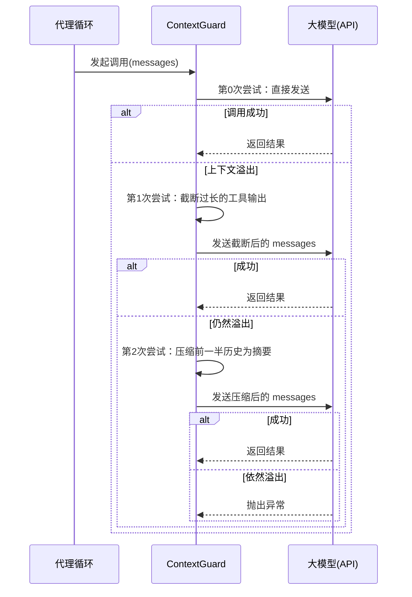

# Chapter 3: 会话管理

在[第1章：代理循环](01_代理循环.md)中，我们让代理学会了循环“听→想→说”；在[第2章：工具使用](02_工具使用.md)中，我们又给它装上了能够动手操作文件的“手”。但这两章的代理都有一个共同的“失忆症”：**一旦关闭程序，之前的所有对话记录就全部消失了，下次打开时又是一个全新的空白助手。**

真实世界里的助手不可能每通电话之后就把之前的记忆全部清空。它必须记住你昨天讨论过的项目细节、上周约定好的文件路径，甚至上个月你纠正过的某个习惯。**会话管理**，就是为代理装上这样一块“长期记忆硬盘”。

这一章，我们将解决三个关键问题：

1. **持久化**：如何把对话记录存到磁盘上，重启后还能完整恢复？
2. **过载保护**：当对话历史越来越长，撑爆模型的“脑容量”（上下文窗口）时，怎么办？
3. **多会话切换**：你可能有多个项目在同时进行，如何让代理在不同项目的记忆之间自如切换？

读完这一章，你将获得一个 **“会存档、会精简、会多线并行”** 的智能代理。我们开始吧。

---

## 从一个让你崩溃的场景开始

假设你正在用代理调试一个 Python 项目：

```
You > 帮我看看 main.py 里有没有语法错误。

Assistant: 我用 read_file 工具帮你检查了，第 12 行少了一个冒号。

You > 修好它。

Assistant: 我已经用 edit_file 工具补上了冒号。

You > 再跑一下测试文件 test_main.py。

Assistant: 测试通过了，没有错误。
```

一切都很顺利，你准备关电脑休息。第二天早上，你重新启动 `claw0`：

```
You > 那我们接着昨天的工作，把 main.py 的异常处理也优化一下。

Assistant: 抱歉，我不知道你指的是哪个 main.py 文件。当前工作目录下有很多文件，能再重复一下之前的上下文吗？
```

代理完全“失忆”了！你不得不重新解释一遍项目结构和修改历史，浪费大把时间。

**这就是没有会话管理的后果。** 有了本章的会话管理，代理会把每一次对话都自动存档，重启后自动恢复，仿佛从未断档。

---

## 三块拼图，拼出完整记忆

解决上面那个场景，需要三个互相配合的组件：

| 组件 | 职责 | 比喻 |
|------|------|------|
| **SessionStore** | 把对话以 JSONL 格式持久化到磁盘，重启后重建完整的 `messages` 数组 | 会议记录员，把每句话都记录在笔记本上 |
| **ContextGuard** | 当对话太长、上下文要撑爆时，自动截断工具输出或压缩历史 | 管家，自动帮你清理堆积的旧文档，腾出工作空间 |
| **REPL命令** | 用 `/new`、`/switch` 等命令手动创建、切换会话 | 文件夹标签，让你在不同项目之间快速切换 |

下面我们逐一拆解它们。

---

## SessionStore：代理的“会议记录员”

### 它解决了什么问题？

每次代理循环处理完一轮对话后，`SessionStore` 会默默把“用户说了什么”、“模型答了什么”、“调用了哪个工具”、“工具输出了什么”这四类事件，**追加写入**一个 `.jsonl` 文件。这是一种“只追加不修改”的记录方式，非常安全，即使突然断电，之前的记录也不会丢失。

下次启动时，`SessionStore` 会把这个文件里的每一行记录重新“翻译”成大模型 API 所需要的 `messages` 数组格式，让模型一下子回到上次对话结束时的状态。

### 用起来有多简单？

启动 `s03_sessions.py` 时，程序会自动加载上一次最新的会话：

```
============================================================
  claw0  |  Section 03: Sessions & Context Guard
  Model: claude-sonnet-4-20250514
  Session: a3f8c1e2d4b6
  已恢复会话: a3f8c1e2d4b6 (12 条消息)
============================================================
```

然后你就可以接着之前的对话继续聊天，就像什么都没发生过一样。你也可以手动创建一个新会话：

```
You > /new 新项目探索

已创建新会话: 7b2e5f9c0a1d (新项目探索)
```

现在你的所有新对话都会记录在这个全新的 `7b2e5f...` 会话里。随时可以用 `/list` 看看当前有哪些会话：

```
You > /list

会话列表:
  a3f8c1e2d4b6 (旧项目)  messages=12  last=2024-12-01T10:30
  7b2e5f9c0a1d (新项目探索)  messages=0  last=2024-12-01T11:00  <-- 当前
```

### 底层如何工作？

在磁盘上，每个会话就是一个 `.jsonl` 文件，存放在：

```
workspace/.sessions/agents/claw0/sessions/a3f8c1e2d4b6.jsonl
```

文件内容每行一条 JSON 记录，看起来可能像这样：

```json
{"type": "user", "content": "帮我看看 main.py", "ts": 1733045600}
{"type": "assistant", "content": [{"type": "text", "text": "好，我先看一下这个文件。"}], "ts": 1733045601}
{"type": "tool_use", "tool_use_id": "toolu_01...", "name": "read_file", "input": {"file_path": "main.py"}, "ts": 1733045602}
{"type": "tool_result", "tool_use_id": "toolu_01...", "content": "print('hello')", "ts": 1733045603}
```

四种类型：`user`（用户消息）、`assistant`（模型回复）、`tool_use`（工具调用请求）、`tool_result`（工具执行结果）。

启动时，`SessionStore` 里的 `_rebuild_history()` 方法会逐行读取这些记录，把它们重新组装成 Anthropic API 要求的格式：严格交替的 `user` / `assistant` 角色，并且把 `tool_use` 块塞进 `assistant` 消息里，把 `tool_result` 块塞进 `user` 消息里。

```python
def _rebuild_history(self, path: Path) -> list[dict]:
    messages = []
    for line in path.read_text().strip().split("\n"):
        record = json.loads(line)
        if record["type"] == "user":
            messages.append({"role": "user", "content": record["content"]})
        elif record["type"] == "assistant":
            # 把 content 从字符串/列表转成 API 格式
            messages.append({"role": "assistant", "content": record["content"]})
        elif record["type"] == "tool_use":
            # 将 tool_use 块合并到上一条 assistant 消息中
            if messages[-1]["role"] == "assistant":
                messages[-1]["content"].append({"type": "tool_use", ...})
        # ... 同理处理 tool_result
    return messages
```

这样，代理重启后拿到的 `messages` 和上次关闭前完全一致。

---

## ContextGuard：上下文过载的“保险丝”

### 它解决了什么问题？

模型的“脑容量”是有限的——我们通常叫它**上下文窗口**。一次 API 调用中，`system` + `messages` 的总 token 数不能超过这个窗口大小（例如 Claude 的 200K tokens）。

如果你连续和代理聊了三个小时，加上它用了很多工具读了很长的文件，`messages` 很容易就膨胀到好几万 token。一旦超出限制，API 会直接报错，代理瞬间“宕机”。

`ContextGuard` 就是专门兜底这个问题的。它把每一次 API 调用都包裹在一个**三级重试策略**里，就像电路里的保险丝，防止上下文溢出导致整个程序崩溃。

### 三级重试策略



1. **第一道防线：截断工具输出**  
   有些工具（比如读取一个巨大的日志文件）会返回几万行的内容。`ContextGuard` 会把超过安全比例的工具输出只保留开头部分，尾部加上 `[... truncated ...]` 标记。大部分情况下，只要这关键开头就足够模型继续推理了。

2. **第二道防线：压缩历史为摘要**  
   如果截断后还是溢出，说明对话本身太长了。这时 `ContextGuard` 会抓取前一半的对话消息，让大模型自己生成一段**简洁的摘要**（比如“用户正在调试一个 Flask 应用，数据库连接失败……”），然后用这段摘要替换掉原始的前一半消息，再拼接上最近的一小段对话。这样既保留了关键信息，又大幅减少了 token 占用。

3. **最后防线：抛出异常**  
   如果连摘要版本都塞不进窗口，那就只能抛出异常，告诉用户当前上下文实在太大了，需要手动 `/compact` 或开启新会话。

整个过程对你在 REPL 里是完全无感的，你只会在终端看到几行温柔的提示：

```
  [guard] 上下文溢出，正在截断工具输出...
  [guard] 仍然溢出，正在压缩历史...
  [compact] 将 24 条消息压缩成了 1 条摘要 (847 字符)
```

然后代理继续正常回答你。

### 压缩历史的代码一瞥

```python
def compact_history(self, messages, api_client, model):
    # 1. 计算保留数量：保留最近20%的消息（至少4条），压缩前面最多50%
    keep_count = max(4, int(len(messages) * 0.2))
    compress_count = max(2, int(len(messages) * 0.5))
    old_msgs = messages[:compress_count]
    recent_msgs = messages[compress_count:]

    # 2. 把旧消息序列化成纯文本，交给 LLM 生成摘要
    old_text = _serialize_messages_for_summary(old_msgs)
    summary_resp = api_client.messages.create(
        model=model,
        max_tokens=2048,
        system="你是一个对话摘要员。",
        messages=[{"role": "user", "content": "请总结：\n" + old_text}],
    )
    summary = summary_resp.content[0].text

    # 3. 用“摘要 + 确认”消息对替换旧消息
    compacted = [
        {"role": "user", "content": "[历史摘要]\n" + summary},
        {"role": "assistant", "content": "已收到，上下文已加载。"},
    ]
    compacted.extend(recent_msgs)
    return compacted
```

注意，压缩后的第一条消息是 `[历史摘要]...`，告诉模型“这是我们之前的要点，你不需要再次执行那些操作，作为背景即可”。

---

## REPL 命令：你的记忆遥控器

除了自动加载和自动保护，你还可以通过几个简单的 `/` 命令手动管理会话，就像遥控器一样便捷。

| 命令 | 功能 | 用法示例 |
|------|------|----------|
| `/new [标签]` | 创建一个全新会话（就像开一个新文件夹） | `/new 学习项目` |
| `/list` | 列出所有已有会话 | `/list` |
| `/switch <前缀>` | 切换到另一个会话，支持前缀匹配 | `/switch a3f` |
| `/context` | 查看当前会话的 token 用量（用进度条展示） | `/context` |
| `/compact` | 手动触发历史压缩（当你想提前腾空间时） | `/compact` |
| `/help` | 显示帮助信息 | `/help` |

试试在对话中途随时敲 `/context`，你会看到类似这样的提示：

```
上下文用量: ~12,450 / 180,000 tokens
[###---------------------------] 6.9%
消息数: 28
```

这个进度条让你心里有底：现在用了多少空间，还剩下多少可以自由挥霍。当进度条变成黄色甚至红色时，你可以主动 `/compact` 一下，提前压缩旧历史，防止后面突然溢出。

---

## 组装起来：带记忆的代理循环

我们把三块拼图放回代理循环，看整个流程是如何运转的：

```python
def agent_loop():
    store = SessionStore()       # 会议记录员
    guard = ContextGuard()       # 保险丝

    # 启动：自动加载上次会话
    messages = store.load_session(latest_session_id)

    while True:
        user_input = input("You > ")

        # REPL 命令拦截
        if user_input.startswith("/"):
            处理命令(user_input, store, guard, messages)
            continue

        # 追加用户消息并持久化
        messages.append({"role": "user", "content": user_input})
        store.save_turn("user", user_input)

        # 内层工具循环（和以前一模一样）
        while True:
            # 关键：用 guard 包裹 API 调用！
            response = guard.guard_api_call(client, MODEL_ID, SYSTEM, messages, TOOLS)
            # ... 处理工具调用与 end_turn，保存 turn 到 store ...
```

变化非常小：

- **启动时**：用 `SessionStore` 加载历史。
- **每次收到用户输入时**：存入 `messages` 的同时，也调用 `store.save_turn()` 写入 JSONL。
- **每次调用 API 时**：不再直接调 `client.messages.create`，而是通过 `guard.guard_api_call` 来调用，给它穿上“防爆服”。

这三个微小的改动，就让代理拥有了持久化、防溢出、多会话的全部能力。原有的代理循环和工具使用逻辑完全不受影响。

---

## 试一试：与“有记忆”的代理对话

确保 `.env` 配置好 API 密钥后，启动示例：

```bash
python en/s03_sessions.py
```

你可以这样体验它的记忆能力：

```
You > 我叫小明，我的项目是关于猫图片分类的。

Assistant: 明白了，小明。我会记住你的项目和名字。

# 按 Ctrl+C 退出，再重新启动

You > 我叫什么？我的项目是什么？

Assistant: 你叫小明，你的项目是关于猫图片分类的。
```

它记住了！因为上一轮的对话已经被写入 JSONL，重启后自动恢复了。

再试一下多会话切换：

```
You > /new 实验区
You > 计算 2 的 10 次方。
Assistant: 1024。

You > /switch 前一个会话的前缀（比如 a3f）
You > 我们刚才在实验区计算的 2^10 是多少？
Assistant: 我刚被切换过来，没有实验区的上下文。需要我重新计算吗？
```

在不同会话之间，记忆是完全隔离的。

---

## 总结与下一站

恭喜你！现在你的代理不再是“转头就忘”的金鱼了。我们学会了：

- **SessionStore** 通过 JSONL 文件实现了对话的持久化，重启后能无损恢复。
- **ContextGuard** 提供了三级防溢出保护，让代理在超长对话中也能稳定运行。
- **REPL命令** 让你可以在多个独立会话之间自由切换，就像在电脑上打开多个文件夹。

这三个组件合在一起，构成了一个成熟代理系统的“记忆层”。它们不改变代理循环和工具使用的基本结构，只是在外围添加了持久化和保护层，这正是良好架构的魅力。

下一章，我们将探索代理如何与外部世界进行更灵活的通信——[第4章：通道通信](04_通道通信.md)。在那里，你会看到代理如何突破单纯的命令行交互，通过不同的“通道”与用户、与其他系统进行双向通信，像微信机器人、Slack 集成等。

准备好了吗？我们继续出发！

---

Generated by [AI Codebase Knowledge Builder](https://github.com/The-Pocket/Tutorial-Codebase-Knowledge)