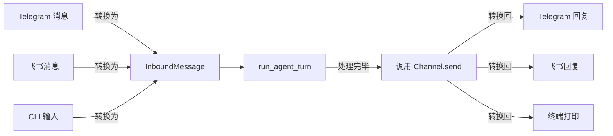

# Chapter 4: 通道通信

在[第3章：会话管理](03_会话管理.md)中，我们给代理装上了“长期记忆”，让它能记住上一次的对话，也能在多个会话之间自如切换。但到目前为止，代理只待在命令行窗口里——你只能通过键盘和它说话，看它把回答打印在屏幕上。现实中的智能助手却需要应对五花八门的“入口”：有的人在 Telegram 上给它发消息，有的人在飞书群里 @ 它，还有的人习惯直接对着终端敲字。

如果你为每一种平台都写一套完全独立的代理逻辑，那代码很快就会变成一锅意大利面——修一个 bug 要改三四十个地方，加一个新功能更是噩梦。本章要介绍的**通道通信**，就是用一把“统一插座”让所有平台都插进同一个代理大脑。不论消息来自命令行、Telegram 还是飞书，代理只看到一种格式；不论回复要发到哪里，代理也只调同一个方法。读完这一章，你将得到一颗“千户脑”，让一个代理同时服务多个平台，而核心逻辑完完全全不用动。

---

## 从一个让你开心的场景说起

假设你用第 2 章的知识给代理配好了工具，用第 3 章的知识让它记住了你的项目。现在你希望无论走到哪里都能召唤它：

- **在办公室电脑前**：直接对着终端说 `帮我看看 todolist`  
- **在地铁上刷手机**：用 Telegram 发一条 `今天有什么会议？`  
- **和同事在飞书群里讨论**：@ 代理 `把最新版部署文档发出来`

你期望的是：这三个地方的对话就像同一个人一样，记忆是共享的，能力是统一的，回复风格是一致的。通道通信就是让这个“处处皆可召唤”的体验成为现实的秘密配方。

---

## 核心思路：一个插座，无数插头

世界各地的电器插头形状千奇百怪，但只要你带上一个万能转换器，出门就不怕。在 claw0 中，**`InboundMessage`** 就是这个标准插座，而每个平台的实现（CLI、Telegram、飞书）就是一个个插头转换器。代理循环只认 `InboundMessage`，不关心它到底从哪个平台来；同样的，代理要回复时，也只通过一个统一的 `send()` 方法发送，由转换器负责把它“翻译”回平台自己的语言。



也就是说，不管增加多少个新平台，代理循环和工具调用**永远不会变**。这正是整个架构最优雅的地方。

---

## 三块积木，搭出万能插口

要完整理解通道通信，只需要认识三样东西：**统一消息体**、**通道抽象类**和**通道管理器**。

### 1. `InboundMessage`：所有消息的唯一格式

```python
@dataclass
class InboundMessage:
    text: str          # 消息正文
    sender_id: str     # 发送者 ID
    channel: str       # "cli"、"telegram"、"feishu" 等
    account_id: str    # 哪个机器人账号收到的（如果你跑了多个机器人）
    peer_id: str       # 会话标识（私聊用 user_id，群聊用 chat_id）
    is_group: bool     # 是不是群组消息
    media: list = ...  # 媒体列表（图片、文件等）
    raw: dict = ...    # 原始平台消息（备用）
```

> **比喻时间**：`InboundMessage` 就像机场行李牌。不管你是坐飞机、火车还是大巴来的，行李牌上统一写着“来自哪儿、是谁的、要送去哪”。地勤只认这张牌，不关心你具体怎么来的。

最精妙的设计在于 `peer_id`，它用不同的编码规则把各种平台的“会话边界”统一了：

| 场景 | peer_id 格式 |
|------|-------------|
| Telegram 私聊 | `user_id` |
| Telegram 群聊 | `chat_id` |
| Telegram 话题群（forum） | `chat_id:topic:thread_id` |
| 飞书单聊 | `user_id` |
| 飞书群聊 | `chat_id` |
| CLI | `cli-user`（固定值） |

这样，[会话管理](03_会话管理.md)的会话 key 就可以直接用 `channel + account_id + peer_id` 来唯一确定一段对话，不会把不同群的聊天混在一起。

### 2. `Channel` 抽象类：一张必须履行的合同

```python
class Channel(ABC):
    name: str = "unknown"

    @abstractmethod
    def receive(self) -> InboundMessage | None: ...
    @abstractmethod
    def send(self, to: str, text: str, **kwargs) -> bool: ...
```

任何平台只要实现了这两个方法，就算拿到了“claw0 通道许可证”。`receive()` 负责从平台收一条消息并转换成 `InboundMessage`；`send()` 负责把代理的回复推到指定会话去。

命令行通道是最简单的例子，一眼就能看懂：

```python
class CLIChannel(Channel):
    name = "cli"

    def receive(self) -> InboundMessage | None:
        text = input("You > ").strip()
        if not text:
            return None
        return InboundMessage(
            text=text, sender_id="cli-user", channel="cli",
            account_id="cli-local", peer_id="cli-user",
        )

    def send(self, to: str, text: str, **kwargs) -> bool:
        print(f"Assistant: {text}")
        return True
```

`receive()` 就是 `input()`，`send()` 就是 `print()`。没有魔法，只有最简单的统一化。

### 3. `ChannelManager`：所有通道的“花名册”

```python
class ChannelManager:
    def __init__(self):
        self.channels: dict[str, Channel] = {}

    def register(self, channel: Channel):
        self.channels[channel.name] = channel

    def get(self, name: str) -> Channel | None:
        return self.channels.get(name)
```

它就像一个钥匙串，把各个通道都挂在一起。代理需要发送回复时，只需要通过 `ChannelManager.get(channel_name)` 找到对应的通道，调用 `.send()` 就好。后面如果想增加一个新平台（比如 Discord），只要把它 `register` 进去，其他代码无需任何修改。

---

## 解决核心用例：让一个代理跑在三个平台上

回到开头那个让你开心的场景。具体怎么实现呢？其实只需要三步：

### 第一步：在主循环里创建通道管理器并注册所有通道

```python
mgr = ChannelManager()
mgr.register(CLIChannel())                     # 命令行
mgr.register(TelegramChannel(telegram_config)) # Telegram
mgr.register(FeishuChannel(feishu_config))     # 飞书（可选）
```

### 第二步：用后台轮询把 Telegram 消息转成 `InboundMessage`

Telegram 不像终端，不能 `input()`。代码会用一条独立的线程，每隔几秒去“问”Telegram 服务器“有没有新消息”，然后把收到的新消息放进一个共享队列。主循环再从前台把这个队列里的消息取出来处理。

```python
# 后台轮询线程的伪代码（真实实现稍复杂）
def telegram_poll_loop():
    while not stop:
        msgs = tg_channel.poll()  # 调用 Telegram API 获取新消息
        for m in msgs:
            inbound_queue.append(m)  # 放入共享队列
```

### 第三步：主循环同时处理 CLI 输入和队列里的消息

```python
while True:
    # 1. 处理从 Telegram 队列里排队的消息
    for inbound in drain_queue():
        run_agent_turn(inbound, conversations, mgr)

    # 2. 非阻塞地检查有没有 CLI 输入
    user_input = read_user_input_nonblocking()
    if user_input:
        run_agent_turn(
            InboundMessage(user_input, "cli", peer_id="cli-user"),
            conversations, mgr,
        )
```

> **重要**：`run_agent_turn` 函数完全不知道消息是从命令行还是 Telegram 来的，它只看到 `InboundMessage`。这个函数里藏着我们在[第1章：代理循环](01_代理循环.md)学到的代理循环，和[第2章：工具使用](02_工具使用.md)学到的工具调度。它们一行都没改！

---

## 深入内部：一条消息的完整旅行

用一张序列图来追踪一条 Telegram 消息从发起到回复的全过程：

```mermaid
sequenceDiagram
    participant User as 用户(Telegram)
    participant TG as Telegram 轮询线程
    participant Q as 共享队列
    participant Loop as 代理主循环
    participant Turn as run_agent_turn
    participant Chan as TelegramChannel

    User->>TG: 发消息 "今天天气？"
    TG->>TG: poll() 拿到原始 JSON
    TG->>TG: 解析为 InboundMessage
    TG->>Q: 放入队列

    Loop->>Q: 取出 InboundMessage
    Loop->>Turn: 传入 InboundMessage + conversations
    Turn->>Turn: 运行工具循环，调用大模型...
    Turn->>Turn: 得到最终文本 "晴天，25℃"
    Turn->>Chan: ch.send(peer_id, "晴天，25℃")
    Chan->>User: 调用 Telegram API 发送回复
```

对于 CLI 输入，过程甚至更简单：`receive()` 直接通过 `input()` 产生 `InboundMessage`，然后一样进入 `run_agent_turn`，最后回复通过 `send()` 用 `print` 输出。两个流程在 `run_agent_turn` 入口处完美汇合。

---

## 自己实现一个新通道有多简单？

假设有一天你想让代理接入 Discord。你需要写的代码只包括：

### 1. 一个新类，实现 `receive` 和 `send`

```python
class DiscordChannel(Channel):
    name = "discord"

    def receive(self) -> InboundMessage | None:
        # 用 Discord SDK 接收消息，转为 InboundMessage
        event = discord_client.wait_for_message()
        if not event:
            return None
        return InboundMessage(
            text=event.content, sender_id=event.author.id,
            channel="discord", account_id="my-bot",
            peer_id=event.channel_id, is_group=event.is_group,
        )

    def send(self, to: str, text: str, **kwargs) -> bool:
        discord_client.send_message(to, text)
        return True
```

### 2. 注册到管理器

```python
mgr.register(DiscordChannel())
```

**这就够了。** 代理循环、工具调度、会话管理，全部原封不动。

---

## 代码速览：`run_agent_turn` 是怎么做到“不通平台心”的？

我们从示例代码中提取最精华的几行，看看这个函数如何保持平台无关性：

```python
def run_agent_turn(inbound, conversations, mgr):
    # 用 channel + peer_id 唯一标识一段对话（记忆隔离）
    sk = f"agent:{inbound.channel}:{inbound.peer_id}"
    messages = conversations.setdefault(sk, [])
    messages.append({"role": "user", "content": inbound.text})

    # 标准的代理循环（和第一章一模一样）
    while True:
        response = client.messages.create(
            model=MODEL_ID, messages=messages, tools=TOOLS, ...
        )
        messages.append({"role": "assistant", "content": response.content})

        if response.stop_reason == "end_turn":
            text = extract_text(response)
            ch = mgr.get(inbound.channel)       # 找到对应的通道
            if ch:
                ch.send(inbound.peer_id, text)   # 委托通道去发送
            break
        elif response.stop_reason == "tool_use":
            # 执行工具，将结果填入 messages，继续循环...
```

注意看，代码里没有出现 `if channel == "telegram": ...` 这样的分支判断。唯一“感知”通道的地方就是最后一句 `ch.send(...)`，而这一步是通过 `ChannelManager` 动态分派的，完美遵循了“开闭原则”。

---

## 生产级小细节：为什么 Telegram 通道里还有缓冲？

上面的简化版 `TelegramChannel` 看上去只是调了一下 Bot API，但生产代码里还藏着两个贴心设计：

- **媒体组缓冲**：如果你一次性发送多张照片，Telegram 会拆成多条更新，每条带同一个 `media_group_id`。通道会把它们先暂存 500ms，等所有部分到齐后合并成一条 `InboundMessage`，避免代理收到“半截消息”。
- **文本拼接**：长消息可能被 Telegram 切成数段发送。通道会把同一会话的连续文本缓冲 1 秒，拼接完整后再交出。

这些细节对代理完全透明，它们只在通道内部消化。**这就是封装的力量。**

---

## 试一试：让代理同时醒在 CLI 和 Telegram 上

确保 `.env` 里有你的 API 密钥和一个 Telegram Bot Token：

```bash
echo 'TELEGRAM_BOT_TOKEN=123456:ABC-DEF...' >> .env
```

然后启动：

```bash
python en/s04_channels.py
```

终端会打印：

```
  [+] Channel registered: cli
  [+] Channel registered: telegram
  [telegram] Polling started for tg-primary
============================================================
  claw0  |  Section 04: Channels
  Model: claude-sonnet-4-20250514
  Channels: cli, telegram
============================================================
```

现在你在 Telegram 上给机器人发消息，它会回答你，同时在终端里也能直接打字聊天。两个地方的对话记忆还互相隔离（因为 `peer_id` 不同）。在终端里打 `/channels` 可以看已注册的通道列表。

---

## 本章小结与下一站

恭喜你！你的代理现在不再只蜗居在命令行里，而是可以同时在 Telegram、飞书等处“开店营业”了。我们学到了：

- **`InboundMessage`** 是所有平台消息的统一表示，把“平台杂音”屏蔽在外。
- **`Channel` 抽象类** 仅要求实现 `receive()` 和 `send()`，新增一个平台就像换一个插头转换器。
- **`ChannelManager`** 统一管理所有通道，代理通过它动态找到正确的出口。
- 代理核心逻辑（`run_agent_turn`）完全不需要知道消息来自哪个平台，也不关心回复发到哪里去。

这些能力为后续的[多代理路由与管理](06_多代理路由与管理.md)和[消息投递](07_消息投递.md)铺好了路。但首先，让我们更进一步，看看代理如何将大模型与外部智能服务深度整合——[第5章：智能集成](05_智能集成.md)。在那里，你会看到代理如何调用搜索引擎、读取网页、解析文档，真正变成一个“知识型助手”。

准备好了吗？我们继续出发！

---

Generated by [AI Codebase Knowledge Builder](https://github.com/The-Pocket/Tutorial-Codebase-Knowledge)