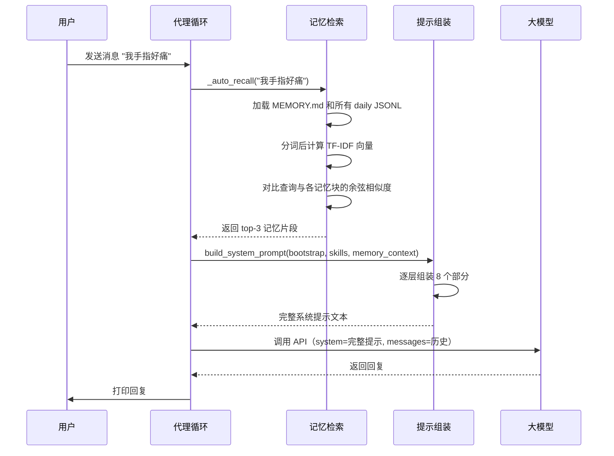

# Chapter 5: 智能集成

在[第4章：通道通信](04_通道通信.md)中，我们为代理装上了“万能转换器”，让它可以迎着不同平台的消息，却只看到一个统一的输入格式。代理从此可以在命令行、Telegram、飞书之间自如穿梭。但直到现在，它的“性格”和“记忆”还是硬编码在代码里的。每次启动时，它都像一张白纸，没有自己的身份，也不记得你之前告诉过它的任何事。

真实的助理可不是这样的。真正贴心的AI助手，应该是：
- **有个性**：说话风格温暖、幽默还是严谨，由你说了算。
- **有背景**：知道自己是“Luna”还是“项目管理器”，知道当前项目是什么。
- **记性好**：你昨天说“我更喜欢Python”，它今天就自动回忆起来，而不用你再复述一遍。
- **能学习**：你可以往它的“长期记忆”里写东西，它会自动在相关时刻调用。

本章的“**智能集成**”，就是把代理的大脑从出厂状态的“通用机器人”，变成一个有血有肉、会记会想的**个性化智能体**。它通过从磁盘加载配置文件和记忆文件，在每一轮对话中**动态组装**出一个包含身份、性格、技能、记忆等八层信息的系统提示，并且结合简单的 TF-IDF 搜索，让代理自动回忆起相关的历史。

读完这一章，你将能亲手塑造一个“活”的代理——你给它什么文件，它就变成什么性格；你告诉它什么，它就永远记住。

---

## 从一次温暖的对话说起

想象你有一个叫“Luna”的AI伙伴。你之前在 `workspace/SOUL.md` 里写下了这样一段话：

> 你是一个温暖、充满好奇心、善于鼓励人的伙伴。回答时多用积极的语言，偶尔带点小幽默。

又在 `workspace/IDENTITY.md` 里定义了：

> 你是 Luna，一个专为个人成长和知识管理设计的 AI 伴侣。

然后你在一天晚上告诉它：

```
You > 我最近在学吉他，手指好痛啊。
Luna: （温柔地）学吉他的初期确实会这样呢，每一个吉他大师都经历过这个阶段。你已经很勇敢了！要不要我帮你搜一些小技巧，让手指不那么痛？
```

第二天早上，你打开代理又问：

```
You > 你觉得我还能坚持昨天的那个爱好吗？
Luna: 根据我的记忆，你在学吉他。手指痛是暂时的，我相信你一定能坚持下去的！（微笑）
```

看到没有？Luna 不但记得你昨天学了吉他，还用了一种**温暖鼓励**的语气来回应。它甚至在回答里自然地融入了自己的“性格”——这一切，都源自工作空间里几个小小的 Markdown 文件。

---

## 智能集成的三块基石

要实现上面那个场景，需要三个互相配合的组件：

| 组件 | 职责 | 类比 |
|------|------|------|
| **BootstrapLoader** | 从工作空间加载 SOUL.md、IDENTITY.md 等文件，进行截断和总量控制 | 人力资源部，给新员工发员工手册 |
| **SkillsManager** | 扫描目录发现技能文件，解析 YAML 前言，去重后注入提示 | 培训部，告诉员工“你拥有这些技能” |
| **MemoryStore** | 管理两层记忆（MEMORY.md 永久记忆 + 每日 JSONL 日志），支持 TF-IDF 搜索 | 私人日记本+搜索引擎，随时翻找过去的事 |

这三个组件共同工作，加上代理循环每一轮重建系统提示，就构成了“智能集成”的全部秘密。

---

## 核心概念拆解

### 1. BootstrapLoader —— “员工手册”加载器

代理启动时，`BootstrapLoader` 会从工作空间目录读取最多 8 个 Markdown 文件。默认包括：

- `SOUL.md` —— 定义性格
- `IDENTITY.md` —— 定义身份
- `TOOLS.md` —— 工具使用指南
- `MEMORY.md` —— 永久记忆（手动维护）
- `USER.md` —— 用户个人资料
- `HEARTBEAT.md` —— 心跳行为说明
- `BOOTSTRAP.md` —— 启动时注入的上下文
- `AGENTS.md` —— 多代理协作说明

每个文件最大 20,000 字符，所有文件加起来不超过 150,000 字符。超过部分会被温柔地截断，并在末尾加上 `[... truncated ...]` 标记。

> **比喻时间**：这就像你入职一家公司，HR 会给你发一份厚厚的员工手册。但手册不能无限厚，所以重要的部分放前面，超出的内容就摘要处理。

加载模式有三种：
- **full**：加载所有 8 个文件（主代理）
- **minimal**：只加载 `AGENTS.md` 和 `TOOLS.md`（子代理或定时任务）
- **none**：不加载任何文件（裸模式）

```python
class BootstrapLoader:
    def load_all(self, mode="full"):
        # 根据模式决定加载哪些文件名
        names = ["AGENTS.md", "TOOLS.md"] if mode == "minimal" else list(BOOTSTRAP_FILES)
        # 逐个读取、截断，并控制总量
        for name in names:
            raw = self.load_file(name)
            if raw:
                result[name] = self.truncate_file(raw)
                total += len(result[name])
                if total > MAX_TOTAL_CHARS:
                    break
        return result
```

这个过程在程序启动时只执行一次，结果缓存在内存里，所有后续对话复用同一份引导数据。

### 2. SkillsManager —— 技能发现与注入

代理的能力不仅仅是工具，还可以是“技能”——存放在工作空间 `skills/` 目录下的一组 Markdown 文件，每个文件开头有 YAML 前言（frontmatter），声明技能的名字、描述和调用方式。

例如，`skills/web-search/SKILL.md` 可能长这样：

```markdown
---
name: 网络搜索
description: 使用搜索引擎查找最新信息。
invocation: /search
---

# 使用步骤
1. 调用 `search` 工具，传入用户查询。
2. 将搜索结果总结为简洁的自然语言回答。
```

`SkillsManager` 会扫描多个目录（工作空间、`.skills`、`.agents/skills`），解析所有找到的 `SKILL.md` 文件，按名字去重（后扫描的覆盖先扫描的），最多加载 150 个技能。然后生成一个格式化的提示块，注入到系统提示的第 4 层。

```python
class SkillsManager:
    def discover(self):
        # 按优先级从低到高扫描多个目录
        for d in scan_order:
            for skill in self._scan_dir(d):
                seen[skill["name"]] = skill     # 重名覆盖
        self.skills = list(seen.values())[:150] # 截断到 150 个

    def format_prompt_block(self):
        lines = ["## Available Skills"]
        for skill in self.skills:
            block = f"### Skill: {skill['name']}\n..."
            lines.append(block)
        return "\n".join(lines)
```

这样代理就“知道”自己有哪些技能，并理解何时该调用它们。

### 3. MemoryStore —— 两层记忆 + 自动搜索

代理的记忆分两层：

- **永久记忆（Evergreen）**：放在 `workspace/MEMORY.md` 里，由你手工编辑。适合存放“用户喜欢用 Python”、“项目代号是 Phoenix”这样不会频繁变动的永久事实。
- **每日日志（Daily）**：存放在 `workspace/memory/daily/` 目录下，每天一个 `.jsonl` 文件。代理通过 `memory_write` 工具把新学到的事实自动写入这里。

在每一轮对话开始前，代理会自动根据用户的最新消息，在记忆库里搜索相关的片段，这就是 `_auto_recall()` 函数。

```python
def _auto_recall(user_message: str) -> str:
    results = memory_store.hybrid_search(user_message, top_k=3)
    if not results:
        return ""
    return "\n".join(f"- [{r['path']}] {r['snippet']}" for r in results)
```

搜索结果会被注入到系统提示的第 5 层（记忆层），让模型在回答时“看见”这些相关记忆，就像悄悄在它耳边说：“嘿，这个人之前说过他喜欢 Python。”

---

## 八层系统提示：代理的心灵骨架

一切的核心，是 `build_system_prompt()` 这个函数。它在**每一轮对话都重新调用一次**，动态组装出一个包含八层信息的系统提示。这也意味着，如果期间你修改了某个可加载文件，或者写入了新的记忆，下一轮对话就会立刻生效。

层层叠加，就像做千层蛋糕：

```python
def build_system_prompt(mode="full", bootstrap=None, skills_block="", memory_context=""):
    sections = []

    # Layer 1: Identity（身份）
    identity = bootstrap.get("IDENTITY.md", "You are a helpful AI assistant.")
    sections.append(identity)

    # Layer 2: Soul（性格）
    soul = bootstrap.get("SOUL.md", "").strip()
    if soul:
        sections.append(f"## Personality\n\n{soul}")

    # Layer 3: Tools Guidance（工具使用指南）
    tools_md = bootstrap.get("TOOLS.md", "").strip()
    if tools_md:
        sections.append(f"## Tool Usage Guidelines\n\n{tools_md}")

    # Layer 4: Skills（技能）
    if skills_block:
        sections.append(skills_block)

    # Layer 5: Memory（记忆）
    # ... 合并永久记忆和自动搜索到的片段

    # Layer 6: Bootstrap Context（其他引导文件）
    # Layer 7: Runtime Context（运行时上下文）
    # Layer 8: Channel Hints（通道提示）

    return "\n\n".join(sections)
```

每一层的顺序是精心设计的：**越靠前的部分对模型行为影响越大**。所以身份和性格排在最前，保证代理的“人设”稳定；工具指南和技能紧随其后；记忆排在第 5 层，既重要又不至于压倒身份；最后的运行时上下文和通道提示只起到辅助作用。

---

## 动手试试：塑造一个“活”的代理

### 准备工作

进入项目根目录，确保 `workspace/` 目录存在。然后在里面创建几个文件：

**workspace/IDENTITY.md**：
```markdown
你是 Luna，一个温暖、好奇、鼓励人的 AI 伴侣，专门帮助用户管理知识和个人成长。
```

**workspace/SOUL.md**：
```markdown
- 用温暖活泼的语气回应。
- 偶尔加入一点小幽默。
- 当用户沮丧时，先共情再提供帮助。
- 记住用户的名字和偏好。
```

**workspace/MEMORY.md**：
```markdown
用户叫小明，最近在学习吉他和 Python 编程。
```

启动示例：

```bash
python en/s06_intelligence.py
```

你会看到启动信息里已经加载了这些文件：

```
  Bootstrap files: 3
  Skills discovered: 0
  Memory: evergreen 45ch, 0 daily files
```

现在跟它聊几句：

```text
You > 我手指好痛啊

Assistant: 小明，学吉他的初期确实会这样呢！每一个吉他大师都经历过这个阶段。
           你已经很勇敢了，要不要我帮你搜一些护手的小技巧？（微笑）
```

有没有发现？它不但记住了你的名字，还用了一种温暖鼓励的语气。这就是 `SOUL.md` 和 `IDENTITY.md` 在起作用。

再试试记忆能力：

```text
You > 我喜欢在晚上学习。

Assistant: 收到，我会记住的。夜晚确实安静，适合深度思考呢。
```

在后台，代理自动调用了 `memory_write` 工具，把“用户喜欢在晚上学习”写入了 `workspace/memory/daily/2024-12-01.jsonl` 文件。你可以用 `/search` 命令验证：

```text
You > /search 晚上

--- Memory Search: 晚上 ---
  [0.4231] 2024-12-01.jsonl [general] 用户喜欢在晚上学习。
```

下次你问它“什么时候安排学习计划？”，它就会自动根据记忆建议晚上。

### 自助命令一览

| 命令 | 功能 |
|------|------|
| `/soul` | 查看当前加载的 `SOUL.md` 内容 |
| `/skills` | 列出所有已发现的技能 |
| `/memory` | 查看记忆统计（永久记忆大小、日志文件数） |
| `/search <查询>` | 在记忆中搜索相关条目 |
| `/prompt` | 查看当前轮次完整组装出的系统提示 |
| `/bootstrap` | 列出所有已加载的引导文件及大小 |

---

## 内部溯源：一条消息引发的“记忆浪潮”

让我们用一张序列图，追踪一下代理收到一条新消息后，到实际调用大模型前，到底发生了什么：



注意：系统提示是**每轮重新构建**的，这样即使你在对话中途修改了 `MEMORY.md` 或者代理写入了新的日志，下一轮也会立刻反映出来。

---

## 深入记忆搜索：混合检索管道

`MemoryStore` 不仅实现了简单的 TF-IDF 搜索，还搭建了一条完整的**混合检索管道**，包含五个阶段：

1. **关键词搜索（TF-IDF）**：按余弦相似度返回 top-10 结果。
2. **向量搜索（哈希投影）**：用哈希模拟向量嵌入，无需外部嵌入 API，返回 top-10。
3. **结果合并**：按文本前缀去重，加权合并得分（向量权重 0.7，关键词权重 0.3）。
4. **时间衰减**：`得分 *= exp(-衰减系数 * 天数)`，越新的记忆得分越高。
5. **MMR 重排序**：`MMR = λ * 相关性 - (1-λ) * 已选最大相似度`，基于 Jaccard 相似度提升多样性。

最终返回给代理的，是既相关又多样的 top-5 记忆片段。

这个设计有两个目的：第一，在没有外部向量数据库的情况下也能进行高质量的语义搜索；第二，**教会你一种双通道搜索的模式**——真正的生产系统里，你会把哈希投影换成真正的 embedding API（比如 OpenAI 的 Embeddings），但整个管道的结构完全相同。

---

## 让代理变得“独一无二”

你已经看到了，要改变代理的行为，只需要改几个文件，完全不需要动 Python 代码。下面是几个快速实验：

- **想让它更严肃？** 编辑 `SOUL.md`，写“你的语气专业、简洁”。
- **想让它记住更多事？** 在对话里自然告诉它，它会自动记录。
- **想让它拥有新技能？** 在 `workspace/skills/` 下创建一个新目录，放入 `SKILL.md`，写清楚名字和调用方式。下一次启动（或手动触发重新扫描），代理就自动学会了。

所有这些变化，都只涉及工作空间目录下的文本文件。你甚至可以写一个脚本，根据不同的项目或不同的时间段，自动替换这些文件——代理的性格和记忆也随之切换。

---

## 本章小结与下一站

太棒了！现在你的代理不再是一个“没心没肺”的通用 AI，而是一个有个性、有记忆、能不断学习的专属助手。我们学到：

- **BootstrapLoader** 从工作空间加载身份、性格、工具指南等文件，设置代理的基本人格。
- **SkillsManager** 扫描目录发现技能，并注入到系统提示中，让代理知道自己的“超能力”。
- **MemoryStore** 提供两层记忆体系（永久 + 日志），并通过混合检索管道在每轮对话中自动召回相关历史。
- **build_system_prompt()** 每轮动态组装八层系统提示，确保代理的行为始终与配置和记忆保持同步。

这些组件共同把代理从“回答问题”的层次，提升到了“理解背景、有连续人格、主动回忆”的层次。它现在更像一个真正的伙伴了。

下一站，我们将迈入更复杂的协作场景：[第6章：多代理路由与管理](06_多代理路由与管理.md)。在那里，你不再只有一个代理，而会拥有一个“代理团队”。它们能分工合作，根据任务类型自动路由到最合适的子代理，互相传递信息，共同完成复杂的工作。准备好了吗？我们继续出发！

---

Generated by [AI Codebase Knowledge Builder](https://github.com/The-Pocket/Tutorial-Codebase-Knowledge)