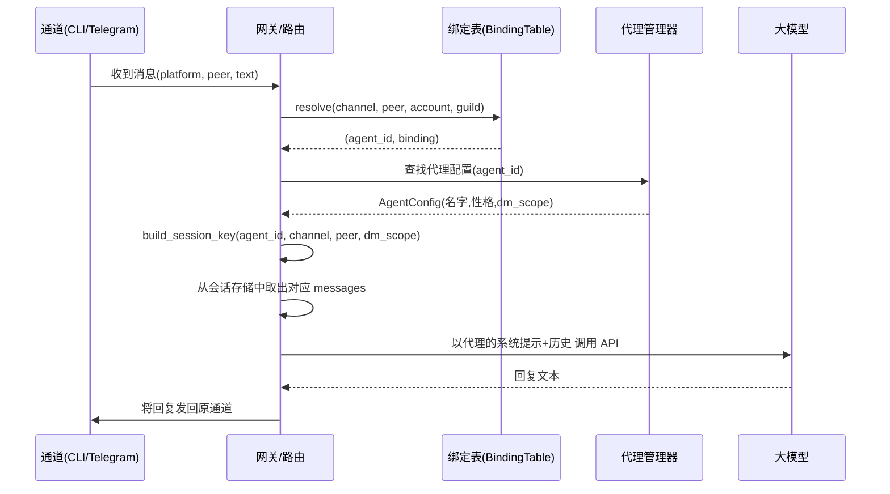

# Chapter 6: 多代理路由与管理

在[第5章：智能集成](05_智能集成.md)中，我们给代理装上了“灵魂”：通过 `SOUL.md`、`IDENTITY.md` 和记忆系统，让它变得有个性、有温度。但你要知道，一个优秀的团队从来不是靠一个人单打独斗的——有时候你需要一个温暖贴心的伙伴给你鼓励，有时候你又需要一个冷静理性的专家帮你分析数据。如果把这些截然不同的“性格”硬塞进同一个代理里，它很容易变得人格分裂。

本章要解决的问题，就是让**多个不同性格、不同专长的代理**和谐地生活在一起。无论用户从命令行、Telegram 还是 Discord 发来消息，系统都能自动把这条消息**路由**到最合适的代理手上，并且保证它们的记忆互不串门。这就是**多代理路由与管理**。

读完这一章，你将拥有一个可弹性扩展的“代理团队”：增加新成员只需要几行配置，而路由规则会帮你自动完成剩下的一切。

---

## 从一个“分身有术”的场景说起

假设你运营着一个技术社区，社区里有两个机器人：

- **Luna**：温柔、充满好奇心，负责欢迎新成员、日常闲聊。  
- **Sage**：直接、善于分析，负责回答技术问题、排查报错。

你希望实现这样的效果：

1. **在 Telegram 群里**，大家都比较随意，消息统一交给 **Sage**（因为 Sage 更擅长应对技术提问）。  
2. **在 Discord 上**，管理员 `admin-001` 发的消息也交给 **Sage**（因为管理员经常问系统问题）。  
3. **其他 Discord 用户**（比如普通成员）的消息则交给 **Luna**，用温暖的语气和大家交流。  
4. **你在命令行 (`cli`)** 里测试时，默认也使用 **Luna**。

这个“根据来源自动分派代理”的能力，就是多代理路由的核心。它完全不需要用户在每条消息前面加“@Sage”或“@Luna”，一切都由后台的路由表自动决定。

---

## 三块积木，搭出“代理分配中心”

实现上面的场景需要三样东西：一个**代理花名册**（AgentManager）、一张**路由规则表**（BindingTable）、以及一个**会话钥匙匠**（Session Key Builder）。

### 1. AgentManager —— 代理花名册

它就是一本通讯录，记录了每一个可用的代理叫什么名字、什么性格、用什么模型、以及私聊时记忆如何隔离。

```python
@dataclass
class AgentConfig:
    id: str            # 唯一标识，如 "luna"
    name: str          # 显示名，如 "Luna"
    personality: str = ""  # 性格描述
    dm_scope: str = "per-peer"  # 会话隔离粒度
```

用起来很简单——注册两个代理：

```python
mgr = AgentManager()
mgr.register(AgentConfig(
    id="luna", name="Luna",
    personality="温暖、充满好奇心，善于鼓励人。",
))
mgr.register(AgentConfig(
    id="sage", name="Sage",
    personality="直接、善于分析，喜欢用事实说话。",
))
```

现在 `mgr` 里就有了两个成员。以后加新成员，只需要再 `register` 一个就行。

### 2. BindingTable —— 五级路由表

路由表就是一张“交通指挥图”。它由多条**绑定记录**组成，每条记录说：“当消息满足某个条件时，交给某个代理。”条件有五个层级，从最具体到最宽泛：

| 层级 | 名称 | 含义 | 比喻 |
|------|------|------|------|
| Tier 1 | `peer_id` | 匹配特定的**发消息的人** | “如果是王经理本人，直接转给他” |
| Tier 2 | `guild_id` | 匹配服务器/公会 | “如果是北京分部群，走这边” |
| Tier 3 | `account_id` | 匹配机器人账号 | “如果是客服专用号，走那边” |
| Tier 4 | `channel` | 匹配整个平台 | “所有 Telegram 消息统一处理” |
| Tier 5 | `default` | 兜底，谁都不匹配时走这里 | “其他所有情况，走默认通道” |

当我们收到一条消息时，系统**从 Tier 1 ~ Tier 5 一路检查**，最先匹配到的那条规则生效。所以越具体（Tier 数字越小）的规则优先级越高。

为了满足开头的场景，我们可以这样配置路由表：

```python
bt = BindingTable()

# 兜底：默认交给 Luna
bt.add(Binding(agent_id="luna", tier=5, match_key="default", match_value="*"))

# 整个 Telegram 平台交给 Sage
bt.add(Binding(agent_id="sage", tier=4, match_key="channel", match_value="telegram"))

# Discord 上的 admin-001 专门交给 Sage（优先级更高）
bt.add(Binding(agent_id="sage", tier=1, match_key="peer_id",
               match_value="discord:admin-001", priority=10))
```

- 第一条是“安全网”：任何消息如果没被前面的规则命中，就去找 Luna。  
- 第二条说：“只要消息来自 Telegram，甭管谁发的，都找 Sage。”  
- 第三条最具体：“Discord 上的管理员 admin-001 也要找 Sage。”这条在 Tier 1，会在 Telegram 的规则之前被检查（针对 Discord 消息时）。

### 3. Session Key —— 记忆隔离的“房间钥匙”

一旦确定了由哪个代理来处理，下个问题就是：这个代理应该**翻阅哪段对话历史**？我们可不想让 Luna 在 Discord 上和普通用户的闲聊，被混进 Sage 在 Telegram 里的技术问答记忆里。

这就需要一个**会话钥匙生成器**。它根据代理 ID、平台、私聊对象，以及代理配置里的 `dm_scope`，生成一把独一无二的“房间钥匙”：

```python
def build_session_key(agent_id, channel, peer_id, dm_scope):
    aid = normalize_agent_id(agent_id)
    if dm_scope == "per-peer" and peer_id:
        return f"agent:{aid}:direct:{peer_id}"        # 每个用户独立记忆
    if dm_scope == "per-channel-peer" and peer_id:
        return f"agent:{aid}:{channel}:direct:{peer_id}"  # 每个平台+用户独立
    # ... 其他粒度
    return f"agent:{aid}:main"  # 所有人共享记忆
```

比如 Luna 的 `dm_scope` 通常设为 `"per-peer"`，这样它跟小明聊的记忆和小红聊的记忆互不影响。而 Sage 如果是社区公告机器人，可能会设为 `"main"`，大家共享一段对话历史。

---

## 把路由和代理连起来：核心解析函数

将这些拼在一起，我们用下面这个函数一步完成“消息来了 → 我该找谁 → 打开哪段记忆”：

```python
def resolve_route(bindings, mgr, channel, peer_id, account_id="", guild_id=""):
    # 1. 查路由表
    agent_id, matched = bindings.resolve(
        channel=channel, account_id=account_id,
        guild_id=guild_id, peer_id=peer_id,
    )
    agent_id = agent_id or "main"  # 万无一失

    # 2. 确定会话隔离粒度
    agent = mgr.get_agent(agent_id)
    dm_scope = agent.dm_scope if agent else "per-peer"

    # 3. 生成记忆钥匙
    session_key = build_session_key(agent_id, channel=channel, 
                                    peer_id=peer_id, dm_scope=dm_scope)
    return agent_id, session_key
```

`bindings.resolve()` 内部就是那个“从 Tier 1 查到 Tier 5”的过程，最先命中的直接返回。

---

## 动手试一下：路由表解析验证

你可以用 `/route` 命令模拟不同来源的消息，看看路由结果：

```
You > /route cli user1

Route Resolution:
  Input:   ch=cli peer=user1 acc=- guild=-
  Agent:   luna (Luna)
  Session: agent:luna:direct:user1
```

因为 CLI 不在任何特殊规则里，所以走了 default → Luna。

```
You > /route telegram user2

Route Resolution:
  Input:   ch=telegram peer=user2 acc=- guild=-
  Agent:   sage (Sage)
  Session: agent:sage:direct:user2
```

Telegram 被 Tier 4 的 channel 规则命中，路由到 Sage。

```
You > /route discord admin-001

Route Resolution:
  Input:   ch=discord peer=admin-001 acc=- guild=-
  Agent:   sage (Sage)
  Session: agent:sage:direct:admin-001
```

Discord 的 admin-001 被 Tier 1 精确命中，即使存在 Telegram 的 Tier 4 规则也不会混淆，因为 Tier 1 优先级更高。

---

## 底层溯源：一条消息的“寻路之旅”

当用户通过任意通道发送消息后，内部发生的事是这样的：



在这整趟旅途中，代理循环和工具使用逻辑（[第1章](01_代理循环.md)、[第2章](02_工具使用.md)）完全不用关心是谁发来的消息、最终走了哪个代理。它们只需要拿着 `agent_id` 和 `session_key` 正常工作即可。

---

## 路由表解析的底层代码一瞥

`BindingTable.resolve()` 的实现非常朴素：遍历排序好的绑定列表，逐个比对字段：

```python
def resolve(self, channel, account_id, guild_id, peer_id):
    for b in self._bindings:                # 已按 (tier, -priority) 排序
        if b.tier == 1 and b.match_key == "peer_id":
            if b.match_value == f"{channel}:{peer_id}":
                return b.agent_id, b
        elif b.tier == 4 and b.match_key == "channel":
            if b.match_value == channel:
                return b.agent_id, b
        elif b.tier == 5 and b.match_key == "default":
            return b.agent_id, b
        # ... 其他层级类似
    return None, None
```

列表是预排序的：Tier 1 排最前，Tier 5 排最后；同 Tier 内 `priority` 高的优先。因此**最先匹配的就是最具体的规则**，完美契合我们的预期。

---

## 多代理并发的“红绿灯”

当多个代理同时运行时，可能会同时有数条消息涌向 LLM API。为了防止资源耗尽，我们使用一个简单的**信号量**来限制最多 4 个并发请求：

```python
_agent_semaphore = asyncio.Semaphore(4)

async def run_agent(mgr, agent_id, session_key, user_text):
    async with _agent_semaphore:   # 最多 4 个同时运行
        # ... 执行代理循环
```

这就像给厨房安排 4 个灶台：再多客人点菜，也只能同时做 4 道，其他人排队等候。保证系统不会因为流量突增而崩溃。

---

## 自己添加一个新代理有多简单？

只需要两步，完全不动路由逻辑：

**第一步**：注册新代理

```python
mgr.register(AgentConfig(
    id="nova", name="Nova",
    personality="创意无限，擅长头脑风暴。",
))
```

**第二步**：添加绑定规则（可选）

```python
# 把所有飞书消息交给 Nova
bt.add(Binding(agent_id="nova", tier=4, match_key="channel", match_value="feishu"))
```

完成！从此所有飞书平台的消息都会由 Nova 处理，而它的会话记忆也会根据配置的 `dm_scope` 自动隔离。其他代理和路由规则完全不受影响。

---

## 网关模式：让外部系统也能“召唤”代理

在实际生产环境中，除了命令行和 Telegram，我们还可能需要通过 WebSocket 接入外部系统。本章代码附带了一个简单的 **JSON-RPC 2.0 网关服务器**，它运行在 `ws://localhost:8765` 上。

你可以在 REPL 中输入 `/gateway` 启动它，然后任何支持 WebSocket 的应用都能通过标准 JSON-RPC 协议发送消息、管理绑定或查看状态。用到的核心方法包括：

- `send`：发送消息，可选指定代理或让路由表自动决定  
- `bindings.set`：动态添加路由规则  
- `bindings.list`：查看所有规则  
- `agents.list`：查看所有注册的代理  
- `status`：查看网关运行状态  

整个网关与前面讲的代理循环、路由表、会话管理完全共用同一套组件，所以无论是从 `cli`、Telegram 还是 WebSocket 进来的消息，都受到相同的路由规则和记忆隔离的保护。

---

## 本章小结与下一站

恭喜你！你现在已经拥有了一个可以动态扩展的“代理团队”。我们学到了：

- **AgentManager** 是代理花名册，注册每一个代理的身份和性格。  
- **五级绑定表** 根据消息来源（peer → guild → account → channel → default）将请求路由到正确的代理，越具体的规则越优先。  
- **会话钥匙** 确保不同代理、不同用户之间的记忆严格隔离，互不串门。  
- **网关服务器** 让外部系统也能通过标准协议接入路由系统。

这些能力让你的系统从“单一助手”一跃成为“多角色协同平台”。你可以为不同的业务场景配置完全不同的代理形象，而用户完全感受不到背后的切换。

下一章我们将深入消息的“最后一公里”——[第7章：消息投递](07_消息投递.md)。在那里，你会看到代理如何将回复精确送回正确的会话、如何处理分片消息、媒体组，以及如何实现优雅的发送重试。准备好让消息精准抵达了吗？我们继续出发！

---

Generated by [AI Codebase Knowledge Builder](https://github.com/The-Pocket/Tutorial-Codebase-Knowledge)