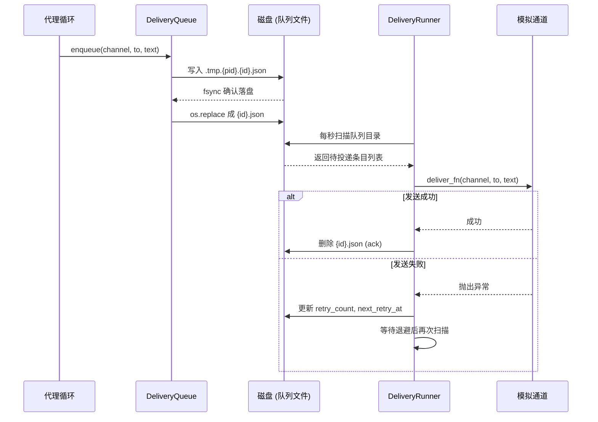

# Chapter 7: 消息投递

在[第6章：多代理路由与管理](06_多代理路由与管理.md)中，我们让消息“找到了对的人”。但是消息最终要发送出去，还得穿越网络、应对各种突发状况——可能网络突然中断、可能对方服务器暂时不可达、甚至程序自己都可能崩溃。

如果只是简单地在代理回复后直接发送，一旦任何一步出错，消息就会**永久丢失**，没有任何痕迹。这对一个可靠的代理系统来说是不可接受的。

本章要介绍的**消息投递**，就是用一种“先记后发”的策略，让每一条外发消息都安安稳稳地抵达目的地——哪怕过程中程序崩溃重启，消息也不会丢。

读完这一章，你将得到一条**可靠的投递管道**，不管环境多动荡，代理的每句话都能妥投。

---

## 从一个让你安心的场景说起

假设你运营着一个在线的助手代理，它通过 Telegram 和用户互动。某天晚上，用户问了一个重要的问题：

```
用户 > 帮我把这份报告的数据导入数据库，并备份原文件。
```

代理收到后，内部处理完毕，准备回复：“✅ 数据已导入，备份文件放在 backup/ 目录下。”

但就在这时——**服务器突然断电了**。

如果没有本章的“写前日志”机制，这条回复就石沉大海了。用户第二天会焦急地问：“你处理了吗？为什么没回我？”

有了消息投递，情况会完全不同：

- 断电前，代理已经将这条回复“登记”在了磁盘上。
- 服务器重启后，投递系统扫描磁盘，发现这条“待办回复”，自动重试发送。
- 用户第二天打开 Telegram，看到回复完好地躺在那里，甚至注意不到中间发生了一次断电。

---

## 核心思路：像寄快递一样发消息

把消息投递想象成你在线下快递站寄包裹：

1. **填单子（写前日志）**：快递员先在系统里登记——寄件人、收件人、物品信息。
2. **装箱（原子写入）**：把包裹封装好，贴上运单号，保证包裹不会破损。
3. **派送（后台投递线程）**：快递员按顺序派送，如果收件人不在家，就第二天再送（重试+退避）。
4. **签收/异常处理（ack / 移入失败目录）**：如果成功送达，就销单；如果超过一定次数还是送不到，就标记为“问题件”单独放一边。

同样的，在 claw0 的消息投递中，我们有：

| 组件 | 职责 | 快递类比 |
|------|------|---------|
| **DeliveryQueue** | 先写入磁盘的投递队列 | 快递站的登记系统 |
| **原子写入** | `tmp文件 → fsync → os.replace` 保证写入完整 | 封装包裹、贴单 |
| **DeliveryRunner** | 后台线程，每秒扫描队列并投递 | 快递员派送 |
| **指数退避 + 重试** | 失败后等待越来越长的时间再重试 | 收件人不在家，第二天再送 |
| **失败目录** | 超过最大重试次数后移入 `failed/` | 问题件专区 |

---

## 关键概念逐个拆解

### 1. DeliveryQueue：先记后发

所有的外发消息——无论是代理的回复、心跳消息、还是定时通知——都必须先通过 `enqueue()` 存入投递队列。

```python
def enqueue(self, channel, to, text):
    delivery_id = uuid.uuid4().hex[:12]   # 生成唯一ID
    entry = QueuedDelivery(id=delivery_id, channel=channel, to=to, text=text)
    self._write_entry(entry)              # 先原子写入磁盘
    return delivery_id
```

`enqueue()` 只做一件事：**把消息安全地记录在磁盘上**，然后立刻返回。它甚至还没开始尝试发送。这样即使程序在下一秒崩溃，消息也已经以文件的形式保留在硬盘上。

### 2. 原子写入：绝不出现“半截文件”

写入使用的是经典的三步原子操作：

```python
def _write_entry(self, entry):
    tmp_path = queue_dir / f".tmp.{os.getpid()}.{entry.id}.json"
    with open(tmp_path, "w") as f:
        f.write(json.dumps(entry.to_dict()))   # 1. 写入临时文件
        f.flush()
        os.fsync(f.fileno())                   # 2. 强制刷到磁盘

    os.replace(str(tmp_path), str(final_path)) # 3. 原子替换
```

这个过程确保：**在任何时刻程序崩溃，磁盘上要么是旧文件，要么是完整的新文件，绝不会出现写到一半的数据**。

> **比喻**：就像你不能把信写到一半就放进信封封口——要么不写，要么写完再封。

### 3. 退避重试：让失败“缓缓再来”

如果发送失败（比如网络异常），系统会为这条消息增加一次失败计数，并计算下一次重试的时间。时间表是**指数退避**——越失败，等得越久，避免在目标服务器还没恢复时疯狂轰炸。

```python
BACKOFF_MS = [5_000, 25_000, 120_000, 600_000]  # 5秒, 25秒, 2分钟, 10分钟

def compute_backoff_ms(retry_count):
    idx = min(retry_count - 1, len(BACKOFF_MS) - 1)
    base = BACKOFF_MS[idx]
    jitter = random.randint(-base // 5, base // 5)  # ±20% 随机抖动
    return max(0, base + jitter)
```

每失败一次重试，下一次等待时间就从 `5秒 → 25秒 → 2分钟 → 10分钟` 递增。加上随机的**抖动**可以防止多个失败消息同时重试造成的“惊群效应”。

在 `fail()` 方法里更新状态：

```python
def fail(self, delivery_id, error):
    entry = self._read_entry(delivery_id)
    entry.retry_count += 1
    entry.last_error = error
    if entry.retry_count >= MAX_RETRIES:
        self.move_to_failed(delivery_id)   # 超过5次，移入 failed/
    else:
        entry.next_retry_at = time.time() + compute_backoff_ms(entry.retry_count) / 1000.0
        self._write_entry(entry)
```

### 4. 失败目录：不再无谓重试

当一条消息重试了 `MAX_RETRIES` 次（默认5次）仍然无法送达时，它会被从主队列目录移到一个 `failed/` 子目录。这样主队列不会被卡住，你也可以后续手动检查这些失败的消息，用 `/retry` 命令重新入队。

### 5. 消息分块：适应不同平台长度限制

不同的平台对单条消息长度有不同限制（Telegram 4096字符，Discord 2000字符…）。在入队前，消息会通过 `chunk_message()` 按段落边界拆成合适的小块，每个小块作为一个独立投递条目。

```python
CHANNEL_LIMITS = {"telegram": 4096, "discord": 2000, "default": 4096}

def chunk_message(text, channel):
    limit = CHANNEL_LIMITS.get(channel, 4096)
    if len(text) <= limit:
        return [text]
    # 按段落拆，尽量不在段落中间切断...
    # 超长段落再按字符硬切
```
代理回复出来后，代码会自动调用：
```python
chunks = chunk_message(response_text, channel)
for chunk in chunks:
    queue.enqueue(channel, to, chunk)
```
这样即使回复非常长，也能拆成多条消息安稳发送。

---

## 一条消息的“投递之旅”

我们来看一个完整的流程：代理生成了一条回复，经过投递系统直到成功发送。



在启动时的恢复扫描中，如果磁盘上残留了上一次运行未处理完的条目，后台线程会立即发现并继续投递。

---

## 动手试试：观察投递和重试

启动示例程序（包含一个模拟通道，可设置失败率）：

```bash
python en/s08_delivery.py
```

你会看到：

```
  [delivery] Recovery: queue is clean
```

现在发送一条消息：

```
You > 你好！

Assistant: 你好呀，今天有什么可以帮你的？

  [delivery] [console] -> user: 你好呀，今天有什么可以帮你的？
```

一切正常。现在打开失败模拟：

```
You > /simulate-failure
  console fail rate -> 50% (unreliable)
```

再发送一条消息：

```
You > 测试失败重试

Assistant: 收到测试。

  [delivery] [console] -> user: 收到测试。
  [warn] Delivery a3f8c1e2... failed (retry 1/5), next retry in 5s: Simulated failure
```

你会看到警告：投递失败了，将在5秒后重试。用 `/queue` 命令可以查看当前等待的条目：

```
You > /queue
  Pending deliveries (1):
    a3f8c1e2... retry=1, wait 3s "收到测试。"
```

等几秒后，后台线程自动重试（如果还失败，等待会更长）。最终当模拟失败率关闭后，消息成功送达，条目自动删除。用 `/stats` 可以看统计：

```
You > /stats
  Delivery stats: pending=0, failed=0, attempted=3, succeeded=1, errors=2
```

你也可以用 `/retry` 手动把 `failed/` 里的消息移回主队列，重新尝试。

---

## 内部实现一瞥：DeliveryRunner 后台循环

这个后台线程的代码非常简单，相当于一个永不停息的“快递员”：

```python
def _background_loop(self):
    while not self._stop_event.is_set():
        self._process_pending()           # 处理所有到期任务
        self._stop_event.wait(timeout=1.0) # 等1秒再扫

def _process_pending(self):
    pending = self.queue.load_pending()
    now = time.time()
    for entry in pending:
        if entry.next_retry_at > now:     # 还没到重试时间
            continue
        try:
            self.deliver_fn(entry.channel, entry.to, entry.text)
            self.queue.ack(entry.id)       # 成功：删除文件
        except Exception as exc:
            self.queue.fail(entry.id, str(exc))  # 失败：更新重试信息
```

它只做两件事：扫描待投递文件、尝试发送。如果成功就删除文件，如果失败就更新文件里的重试计数和下次重试时间，然后等待退避时间后再来。

---

## 如何接入自己的真实通道？

上面的示例中使用的是 `MockDeliveryChannel`（模拟通道）。但在你自己的系统里，只需要把 `deliver_fn` 替换成真实的发送函数，比如在[第4章：通道通信](04_通道通信.md)中学到的 `Channel.send()` 方法。

```python
def real_deliver_fn(channel_name, to, text):
    ch = channel_manager.get(channel_name)   # 从通道管理器取出对应通道
    success = ch.send(to, text)
    if not success:
        raise RuntimeError(f"发送失败到 {channel_name}/{to}")

runner = DeliveryRunner(queue, real_deliver_fn)
```

所有的排队、重试、失败处理，仍然由 `DeliveryQueue` 和 `DeliveryRunner` 全权负责，你不需要自己写任何重试逻辑。

---

## 本章小结与下一站

太棒了！现在你的代理拥有了一个**崩溃安全的投递引擎**。我们学到了：

- **DeliveryQueue** 通过“写前日志”保证消息在发送前已安全落盘。
- **原子写入**（临时文件 + `fsync` + `os.replace`）确保文件永远不会处于不完整状态。
- **指数退避 + 随机抖动** 让重试更“温柔、有效”，避免惊群。
- **失败目录** 把超过重试阈值的消息移走，保证主流队列不被阻塞。
- **消息分块** 自动适配各平台的字符限制。
- **后台投递线程** 在启动时自动恢复上次遗留的任务，真正做到“即宕即发”。

这些能力让你的代理系统在真实世界中不再惧怕断网、崩溃、限流等问题。但是，一个可靠的代理还需要有“自觉性”——它应该能主动定时检查、发心跳、执行周期性任务。这正是下一章的主题：[第8章：心跳与定时任务](08_心跳与定时任务.md)。在那里，你会看到如何让代理在没有用户输入时也能自主“跳动”，成为一个真正活着的系统。

准备好了吗？我们继续出发！

---

Generated by [AI Codebase Knowledge Builder](https://github.com/The-Pocket/Tutorial-Codebase-Knowledge)