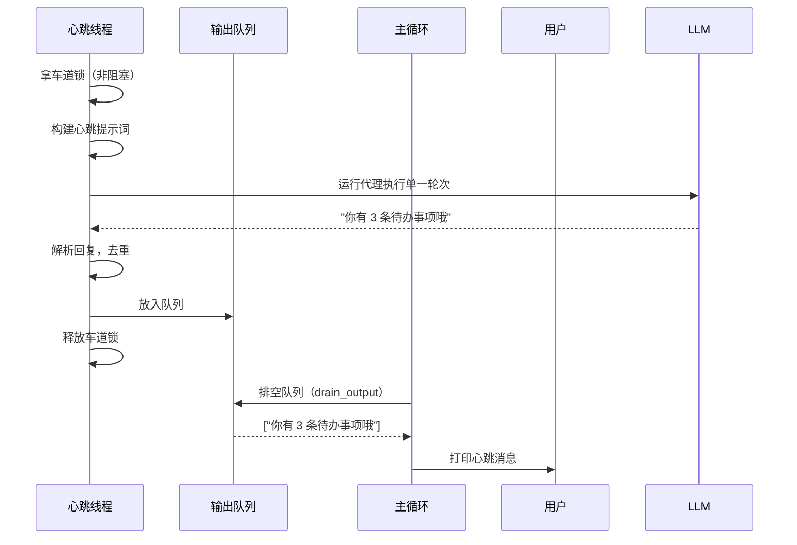

# Chapter 8: 心跳与定时任务

在[第7章：消息投递](07_消息投递.md)中，我们让代理学会了"说话要靠谱"——每条外发消息都要先记在磁盘上、再稳妥送达，绝不丢失。但直到现在，代理仍然有一个很大的限制：**它只有在收到你的消息时，才会动起来。** 就像一位只在按下门铃时才醒来的管家，其他时间都在沉睡。

真实的助理可不只是被动等待。真正贴心的助手，应该在每天早上主动检查天气、在你可能忘记时提醒你喝水、在深夜自动清理垃圾文件……它们有一种内在的生命力，会主动跳出来说：

> "嘿，我注意到你可能需要这个。"

本章的**心跳与定时任务**，就是为代理装上这样一颗"自主跳动的心脏"。我们将学会用一条后台线程让代理定期"自己唤醒自己"，并通过精心设计的"车道锁（lane lock）"确保用户的主动请求始终优先。同时，我们还会为代理配备一个 **Cron 定时服务**，像闹钟一样在预定的时间自动执行任务。

读完这一章，你将拥有一个**既被动响应、又主动关怀**的"活"代理系统。

---

## 从一个让你安心的早晨说起

假设你每天早上 8 点半到办公室，打开电脑，希望代理已经提前为你准备好了：

1. **健康提醒**：每隔两小时提醒你站起来活动一下。
2. **每日总结**：早上 9 点自动生成一份你昨天的工作摘要。
3. **文件清理**：每晚 10 点自动清空临时下载目录。

这些都不是你"问"出来的，而是代理在后台自己做的。就像你的手机每隔一段时间会自动检查邮件——**你的代理应该也能有自己的"心跳"，按节奏自动做事情。**

现在我们来看看怎么实现它。

---

## 核心概念：两条"车道" + 一个"闹钟"

心跳与定时任务由三个关键组件构成：

| 组件 | 职责 | 生活中的类比 |
|------|------|------------|
| **车道锁 (Lane Lock)** | 保证用户请求和心跳任务不会"撞车" | 高速公路上的两条车道，有一条永远是"优先车道" |
| **心跳执行器 (HeartbeatRunner)** | 根据 `HEARTBEAT.md` 的指示，定期主动执行一次代理任务 | 管家每隔一段时间巡视一圈，看看有没有该做的事 |
| **Cron 定时服务 (CronService)** | 根据 `CRON.json` 的时间表，准时触发特定任务 | 闹钟，到了设定时间就响 |

其中**车道锁**是这三者里最精妙的设计，我们得先理解它。

---

## 车道锁：让用户永远优先

### 为什么要用"两条车道"？

假设没有车道锁。用户正和代理对话中：

```
You > 帮我查一下这个大型数据库，可能要花 10 秒。

# 与此同时，心跳线程也触发了：
Heartbeat > 检查一下今天有什么提醒...
```

如果两条请求同时冲向大模型 API，可能会导致：
- 响应乱串（心跳回复被用户看到）
- API 限流（同时发太多请求）
- 上下文混乱（两条回复互相干扰）

**车道锁**就是解决这个问题的：同一时刻，只允许一条车道运行。并且，用户请求用的"主车道"拥有绝对优先权——它采用**阻塞等待**，死等也要拿到锁；心跳任务用的"心跳车道"则采用**非阻塞尝试**，拿不到锁就乖乖跳过，等用户忙完再说。

```python
lane_lock = threading.Lock()

# 主车道（用户请求）：阻塞获取
# 用户必须得到服务，哪怕等一会儿
lane_lock.acquire()          # 死等，直到拿到锁
try:
    # 处理用户消息，调用大模型...
finally:
    lane_lock.release()       # 释放锁，心跳才能进来

# 心跳车道（后台任务）：非阻塞尝试
# 能拿到就做，拿不到就等下次
acquired = lane_lock.acquire(blocking=False)  # 拿不到立刻返回 False
if not acquired:
    return   # 用户正用着，我先不打扰了
try:
    # 执行心跳任务...
finally:
    lane_lock.release()
```

> **比喻时间**：这就像餐厅里的一条 VIP 通道和一条普通通道。VIP 来了，普通通道的人就停下让 VIP 先过去；VIP 没来时，普通通道正常使用。VIP 绝不会因为普通通道有人而被堵住。

---

## 心跳执行器：代理的"自动检查"

### 心跳怎么知道"该做什么"？

心跳执行器会读取工作空间下一个叫 `HEARTBEAT.md` 的文件。这个文件里写的不是代码，而是一段**自然语言指令**，告诉代理"每次醒来时，你该去检查什么"。

比如你的 `workspace/HEARTBEAT.md` 可以这样写：

```markdown
请检查以下几点：
1. 用户有没有今天到期的待办事项？如果有，生成一条提醒消息。
2. 检查工作空间的临时文件，如果超过 100MB，建议清理。
3. 如果没有可报告的事项，只回复 `HEARTBEAT_OK`。
```

心跳触发后，代理拿着这段指令去调用大模型，得到一个自然语言的回复。如果回复中包含 `HEARTBEAT_OK`，说明"一切正常，没什么要报告的"；如果包含有意义的文本，就把它当作一个提醒，投递给用户。

### 心跳触发前要过"四道关卡"

心跳可不是随时都能跳的。在 `should_run()` 方法里，有 4 个前置条件必须全部满足：

```python
def should_run(self) -> tuple[bool, str]:
    # 关卡1：HEARTBEAT.md 存在吗？
    if not self.heartbeat_path.exists():
        return False, "HEARTBEAT.md not found"

    # 关卡2：距离上次心跳是否超过了间隔时间？（默认 30 分钟）
    elapsed = time.time() - self.last_run_at
    if elapsed < self.interval:
        return False, "还没到间隔时间"

    # 关卡3：当前时间在"活跃时段"内吗？（默认 9:00-22:00）
    hour = datetime.now().hour
    if not (self.active_hours[0] <= hour < self.active_hours[1]):
        return False, "不在活跃时段内"

    # 关卡4：上一次心跳还在运行中吗？
    if self.running:
        return False, "上一次心跳还在运行"

    return True, "所有检查通过"
```

这四道关卡就像一道安检门，确保心跳只在恰当的时间运行——不会半夜三更把用户吵醒，也不会两次心跳挤在一起。

> **小贴士**：关卡 2 和 3 可以通过环境变量轻松调整：`HEARTBEAT_INTERVAL=900`（15分钟）、`HEARTBEAT_ACTIVE_START=7`、`HEARTBEAT_ACTIVE_END=23`。

---

## Cron 定时服务：像闹钟一样准时

心跳是"定期检查"，没有固定的触发时间表。但有些任务需要在**精确的时间点**运行，比如"每天早上 9 点生成日报"、"每周一 8 点开例会提醒"。这就是 Cron 定时服务的用武之地。

### 三种时间表类型

Cron 任务定义在 `workspace/CRON.json` 里，支持三种时间模式：

| 类型 | 含义 | 配置示例 |
|------|------|---------|
| `at` | 在指定时间运行一次 | `{"kind": "at", "at": "2024-12-25T08:00:00"}` |
| `every` | 每隔固定秒数运行 | `{"kind": "every", "every_seconds": 3600}` |
| `cron` | 用标准 Cron 表达式 | `{"kind": "cron", "expr": "0 9 * * *"}` |

一个完整的 `CRON.json` 长这样：

```json
{
  "jobs": [
    {
      "id": "daily-summary",
      "name": "每日摘要",
      "enabled": true,
      "schedule": {"kind": "cron", "expr": "0 9 * * *"},
      "payload": {
        "kind": "agent_turn",
        "message": "生成一份昨天的活动摘要。"
      }
    }
  ]
}
```

- `id`：任务的唯一标识。
- `enabled`：开关，设为 `false` 就能暂停任务。
- `schedule`：告诉系统"什么时候运行"。
- `payload`：告诉系统"运行时要做什么"。

### 自动禁用：连续失败 5 次就"熔断"

和[第7章](07_消息投递.md)学到的"失败目录"类似，Cron 服务也有自己的保护机制：**如果一个任务连续 5 次执行失败，系统会自动把它禁用。** 这可以防止一个有 bug 的定时任务每半小时炸一次，占用资源。

```python
if status == "error":
    job.consecutive_errors += 1
    if job.consecutive_errors >= 5:
        job.enabled = False
        print(f"[cron] 任务 '{job.name}' 已被自动禁用（连续 {job.consecutive_errors} 次失败）")
else:
    job.consecutive_errors = 0   # 成功一次就清零
```

每次运行的结果（成功与否、输出片段、错误信息）都会被记录到 `workspace/cron/cron-runs.jsonl`，方便后期排查。

---

## 整合：一条心跳消息的完整旅程

当后台心跳线程产生了一条有意义的输出（比如"用户，你今天有 3 条待办事项哦"），它不是直接打印到屏幕上，而是放入一个**输出队列**。主循环在每一轮等待用户输入之前，先检查这个队列，把排队的心跳消息安全地排出来展示：



对于 Cron 任务的输出，也是同样的流程：Cron 服务的后台循环每秒 `tick()` 一次，检查是否有到期的任务，执行后把结果放入自己的输出队列，主循环再统一排空。

---

## 动手试试：让你的代理"活"起来

### 第一步：准备工作

在 `workspace/` 目录下创建 `HEARTBEAT.md`：

```markdown
你是一个后台健康检查助手。请检查：
1. 给我一句早晨的问候语，如果现在是上午的话。
2. 提示我该站起来活动了，如果我上次活动已经超过 2 小时。
3. 如果没什么要说的，只回复 `HEARTBEAT_OK`。
```

再创建一个 `workspace/CRON.json`：

```json
{
  "jobs": [
    {
      "id": "test-reminder",
      "name": "测试提醒",
      "enabled": true,
      "schedule": {"kind": "every", "every_seconds": 60},
      "payload": {
        "kind": "agent_turn",
        "message": "用一句话提醒我喝水。"
      }
    }
  ]
}
```

### 第二步：启动代理

```bash
python en/s07_heartbeat_cron.py
```

启动后你会看到类似信息：

```
============================================================
  claw0  |  Section 07: Heartbeat & Cron
  Model: claude-sonnet-4-20250514
  Heartbeat: on (1800s)
  Cron jobs: 1
============================================================
```

### 第三步：观察自主行为

等几十秒后，你会看到 Cron 任务的输出：

```
[cron] [测试提醒] 💧 记得喝点水哦，补充水分对大脑运转很重要！
```

你也可以用命令查看心跳状态或手动触发：

```
You > /heartbeat
  enabled: True
  running: False
  should_run: True
  reason: 所有检查通过
  last_run: never
  next_in: 0s

You > /trigger
  已触发，输出已入队 (42 chars)
[heartbeat] ☀️ 早上好！新的一天开始了，祝你今天工作顺利！

You > /cron
  [ON] test-reminder - 测试提醒 in 52s
```

---

## 深入内部：心跳执行器如何构建提示词？

心跳执行器在运行前，会把 `HEARTBEAT.md` 的指令、当前时间、以及[第5章](05_智能集成.md)学到的记忆（`MEMORY.md`）合并成一份完整的上下文：

```python
def _build_heartbeat_prompt(self) -> tuple[str, str]:
    instructions = self.heartbeat_path.read_text().strip()  # HEARTBEAT.md
    mem = self._memory.load_evergreen()                     # 永久记忆
    extra = f"## Known Context\n\n{mem}\n\n" if mem else ""
    extra += f"当前时间: {datetime.now().strftime('%Y-%m-%d %H:%M:%S')}"
    return instructions, self._soul.build_system_prompt(extra)
```

然后调用 `run_agent_single_turn()` 发送给大模型。这个函数和我们之前学过的代理循环很像，只不过它只做"一轮"：发送一次，收一次回复，不循环。

---

## Cron 的"锚点"机制：让重复任务更可预测

你可能注意到，在 `_compute_next()` 里用 `every` 类型时，代码会先计算一个"锚点时间"。这是为了**让重复任务的触发时间点稳定可预测**，不会因为程序重启就跑偏：

```python
if job.schedule_kind == "every":
    every = cfg.get("every_seconds", 3600)
    anchor = cfg.get("anchor", now)   # 锚点时间
    steps = int((now - anchor) / every) + 1
    return anchor + steps * every
```

> **比喻**：就像公交车时刻表——8:00 发第一班，之后每隔 15 分钟一班。即使你 8:07 才到车站，下一班还是 8:15，不会变成 8:22。

---

## 本章小结与下一站

太棒了！现在你的代理不再只是一个"随叫随到"的仆人，而是一个会主动关心你的伙伴。我们学到了：

- **车道锁（Lane Lock）** 用一条公共锁实现了用户请求与心跳任务的互斥，并且用户**永远优先**（阻塞 vs. 非阻塞）。
- **心跳执行器（HeartbeatRunner）** 根据 `HEARTBEAT.md` 的自然语言指令，定期检查并主动报告，通过了四道前置关卡。
- **Cron 定时服务（CronService）** 支持三种时间表类型，在 `CRON.json` 中配置，自动执行定时任务，并在连续失败 5 次后自动禁用。

这三个组件共同为代理装上了一颗"自主心跳"，让它成为真正 7×24 小时在线的智能系统。

下一章，我们将关注系统在压力下的表现：[第9章：弹性与容错](09_弹性与容错.md)。在那里，你会看到当 API 限流、网络抖动、程序崩溃等意外发生时，代理如何优雅地恢复，保持稳定运行。真正的可靠性，不是不出错，而是出错了也能自己站起来。准备好了吗？我们继续出发！

---

Generated by [AI Codebase Knowledge Builder](https://github.com/The-Pocket/Tutorial-Codebase-Knowledge)