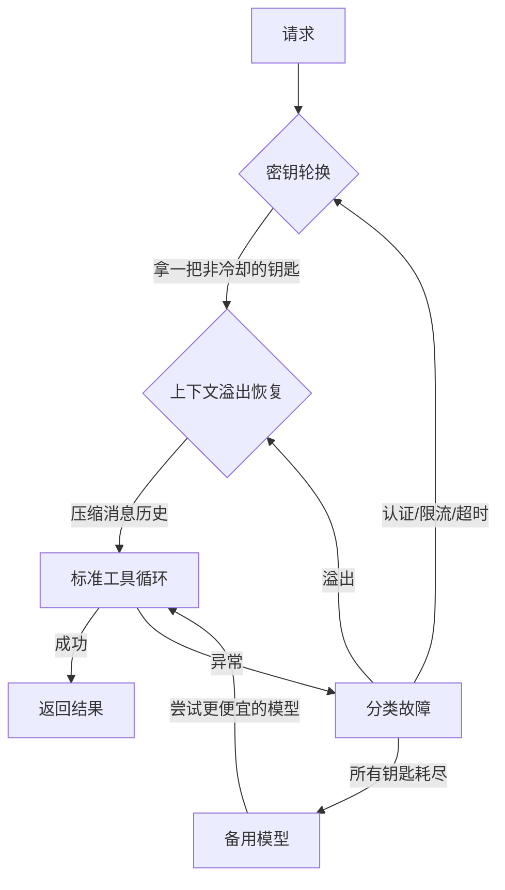
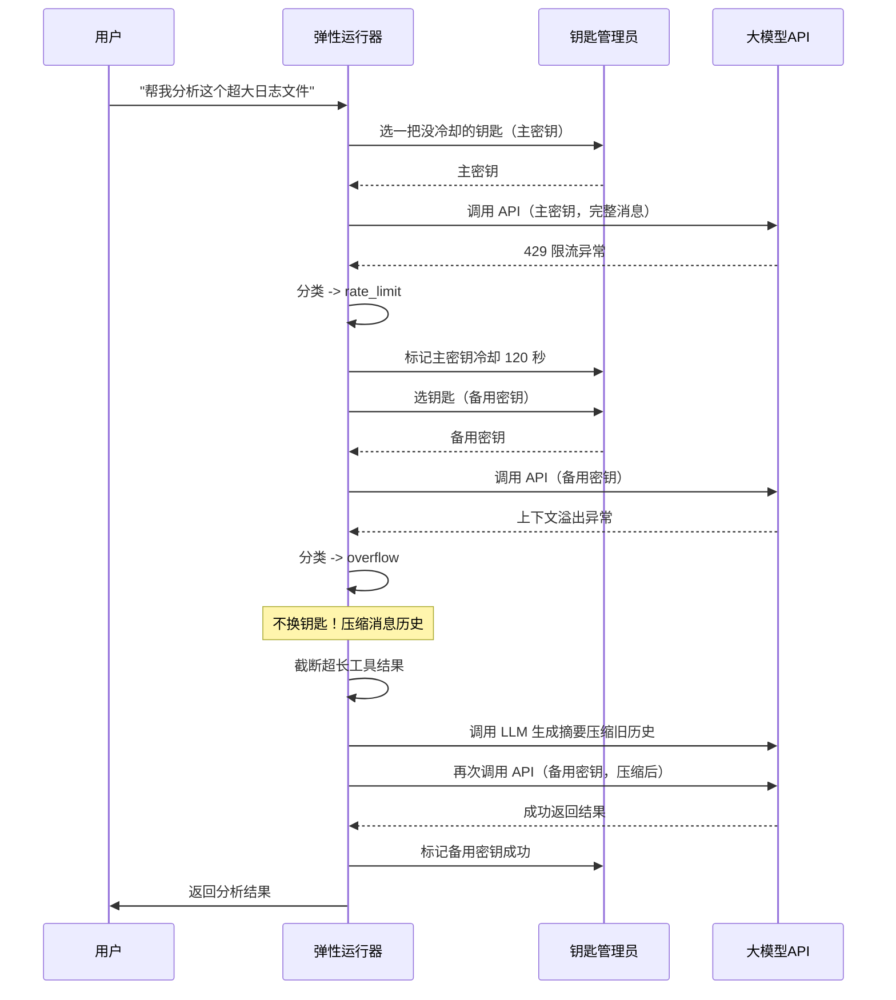

# Chapter 9: 弹性与容错

在[第8章：心跳与定时任务](08_心跳与定时任务.md)里，我们给代理装上了一颗“自主心跳”，让它能主动检查、定时汇报。现在你的代理已经是一个 24 小时在线、有性格、有记忆、能自己蹦哒起来的强大助手了。

但是，**现实世界可不像幼儿园那么温柔**。网络随时可能抖动、API 密钥可能突然失效、上下文偶尔会溢出窗口边界……如果你的代理一遇到这些问题就崩溃，那前面所有的努力都白费了。

本章要解决的问题，就是让代理在风吹雨打中依然站得稳稳当当。我们将构建一座**三层重试洋葱**——不管哪一层出问题，内层扛不住的就交给外层，像打不死的小强一样不断尝试，直到成功；如果实在所有钥匙都打不开门，它还会自动换一把“便宜点”的备用模型，保证你不会在关键时刻断联。

读完这一章，你将得到一个**能自己站起来**的代理系统——真正的可靠，不是不犯错，而是犯了错也能优雅恢复。

---

## 从一个“世界末日的早晨”说起

假设你运营着一个名为 Luna 的 AI 助手，她每天早上 9 点会通过 `CRON.md` 生成的摘要提醒你待办事项。但某天早上，事情一件接一件地崩盘：

1. 你的主 API 密钥不知为何被限流了（`429 rate_limit`）。
2. 你慌忙切到备用密钥，结果网络抽风，请求超时了（`timeout`）。
3. 你急得满头汗，又翻出了第三个“紧急密钥”，总算通了……可此时之前的对话历史太长，上下文溢出，API 又炸了（`context overflow`）。

如果没有弹性机制，你的代理会在第一条报错的时候就停了下来，你只能对着冰冷的错误提示干瞪眼。但有了本节学到的**弹性容错**，代理会自己做到：

- **密钥轮换**：主钥匙不行，自动换备用钥匙。
- **上下文压缩**：当历史太臃肿时，自动截断长工具输出，甚至让 LLM 自己写摘要压缩历史。
- **备用模型**：如果所有密钥都挂了，它还会换个更便宜、更稳定的模型再试一次。

最终，Luna 顺利发出了早间问候，你甚至不知道背后发生过这么多波折。

---

## 三个关键积木，搭出“不死小强”

要理解弹性与容错，我们需要先认识三个核心组件，它们构成了整个重试洋葱的骨架。

| 组件 | 职责 | 生活中的类比 |
|------|------|------------|
| **FailoverReason（故障分类器）** | 看一眼报错信息，就知道是什么类型的问题 | 急诊分诊护士，“你是发烧、骨折还是过敏？” |
| **AuthProfile + ProfileManager** | 管理多把 API 密钥，给每把钥匙加上“冷却时间” | 钥匙串，一把打不开门，歇一会儿再试下一把 |
| **ResilienceRunner（三层洋葱运行器）** | 按照顺序执行：换钥匙 → 清上下文 → 跑工具，直到成功 | 顽强的快递员，敲门不开就多敲几次，实在不行换备用路线 |

它们的分工配合可以画成这样：



> **比喻时间**：这就像你要打开一个保险箱。先试第一把钥匙（层1），如果门有点卡（上下文膨胀），先给锁孔喷点润滑油（层2），然后再试。如果钥匙断了，就换一把新的（层1循环）；如果所有钥匙都断了，最后用一把万能钥匙（备用模型）赌一把。

---

## 拆解第一块积木：`FailoverReason` —— 急诊分诊护士

每次调用大模型 API 时，它可能会抛出各种各样的异常。代码里根本不可能预先写死每一种错误消息，但我们其实只需要知道它是**哪种类型**的错误，从而决定下一步该做什么。

`classify_failure()` 函数会检查异常文本中的关键词，给它贴上六种标签之一：

| 标签 | 含义 | 看完后该做什么？ |
|------|------|------------------|
| `rate_limit` | 请求太频繁，被限流了 | 换密钥，等一会儿再试 |
| `auth` | 认证失败（密钥无效） | 这把钥匙废了，换下一把 |
| `timeout` | 网络超时 | 短暂冷却后，换下一把 |
| `billing` | 余额不足或配额用光 | 这把钥匙没钱了，换下一把 |
| `overflow` | 上下文溢出 | 别换钥匙！压缩消息历史再重试 |
| `unknown` | 不知道什么原因 | 冷却一段时间，换钥匙 |

贴标签的代码非常简单，就是一堆 `if "关键词" in 错误信息` 的判断：

```python
def classify_failure(exc: Exception) -> FailoverReason:
    msg = str(exc).lower()
    if "rate" in msg or "429" in msg:
        return FailoverReason.rate_limit
    if "auth" in msg or "401" in msg or "key" in msg:
        return FailoverReason.auth
    if "timeout" in msg or "timed out" in msg:
        return FailoverReason.timeout
    if "billing" in msg or "quota" in msg or "402" in msg:
        return FailoverReason.billing
    if "context" in msg or "token" in msg or "overflow" in msg:
        return FailoverReason.overflow
    return FailoverReason.unknown
```

一旦有了这个标签，三层洋葱就知道针对不同病情开什么药了——**分类决定后续的重试策略**。

---

## 拆解第二块积木：`AuthProfile` 与 `ProfileManager` —— 带冷却的钥匙串

### 每把钥匙都是一张“冷却状态卡”

`AuthProfile` 就是一个简单的数据结构，保存一把 API 密钥，同时记录：

- 这把钥匙现在是否在冷却中（`cooldown_until`）？
- 上次失败的原因是什么？
- 上次成功是什么时候？

```python
@dataclass
class AuthProfile:
    name: str              # 钥匙的名字，如 "主密钥"
    provider: str          # 供应商，如 "anthropic"
    api_key: str           # 实际的密钥字符串
    cooldown_until: float = 0.0   # 冷却到期时间
    failure_reason: str | None = None
    last_good_at: float = 0.0
```

### 钥匙管理员负责“挑钥匙”和“开冷却”

`ProfileManager` 管理着一串钥匙，并按顺序挑选第一把没在冷却的：

```python
class ProfileManager:
    def select_profile(self) -> AuthProfile | None:
        now = time.time()
        for p in self.profiles:
            if now >= p.cooldown_until:   # 冷却结束了吗？
                return p
        return None    # 全部都在冷却
```

一旦调用失败，管理员就给这把钥匙贴上“冷却”标签，并根据故障类型设置不同的冷却时间：

```python
    def mark_failure(self, profile, reason, cooldown_seconds=300.0):
        profile.cooldown_until = time.time() + cooldown_seconds
        profile.failure_reason = reason.value
```

- `auth` / `billing`：冷却 300 秒（钥匙本身有问题，等久一点）  
- `rate_limit`：冷却 120 秒（等限流窗口过去）  
- `timeout`：冷却 60 秒（短暂的网络波动，很快就好）

一旦成功，就立即擦掉冷却记录：

```python
    def mark_success(self, profile):
        profile.failure_reason = None
        profile.last_good_at = time.time()
```

这样，整套系统就能安全地在多把钥匙之间**轮换**，而不会对已经损坏的钥匙无脑重试。

---

## 拆解第三块积木：`ResilienceRunner` —— 三层洋葱的心脏

现在我们把故障分类和钥匙管理组装进一个重型引擎里，这个引擎的执行流程就是**三层重试洋葱**。

为了更直观地理解，我们追踪一条“主密钥被限流，备用密钥超时，上下文还溢出了”的混乱消息，看它如何穿过洋葱：



外层循环管“换钥匙”，中层循环管“清上下文”，内层循环就是我们已经非常熟悉的[代理循环](01_代理循环.md) + [工具使用](02_工具使用.md)那一套。这种洋葱式设计让每一层只关心自己的职责，不会乱成一团。

---

## 下面我们看看这棵洋葱的代码骨架

以下代码**强烈建议按顺序读**，我会把每一块拆得很短。

### 层1：遍历可用的钥匙

```python
# 在 resilience runner 的 run 方法中
for _rotation in range(len(self.profiles)):
    profile = self.profile_manager.select_profile()
    if profile is None:          # 全在冷却
        break
    api_client = Anthropic(api_key=profile.api_key)
    # ... 进入层2 ...
```

每次拿到一把没有冷却的钥匙，就给它一次机会，进入到层2。

### 层2：上下文溢出重试

```python
    layer2_messages = list(current_messages)
    for compact_attempt in range(MAX_OVERFLOW_COMPACTION):
        try:
            # 调用层3的工具循环
            result, layer2_messages = self._run_attempt(...)
            self.profile_manager.mark_success(profile)
            return result, layer2_messages
        except Exception as exc:
            reason = classify_failure(exc)
            if reason == FailoverReason.overflow:
                # 截断工具结果，压缩历史，继续尝试
                layer2_messages = self.guard.truncate_tool_results(layer2_messages)
                layer2_messages = self.guard.compact_history(...)
                continue   # 回到层2顶部，重试
            else:
                # 非溢出故障：标记钥匙冷却，跳出层2，下一把钥匙
                self.profile_manager.mark_failure(profile, reason)
                break
```

这里的关键是：**只有 `overflow` 会在同一把钥匙下压缩重试**；其它错误都会立刻放弃当前钥匙，回到层1去换下一把。

### 层3：我们最熟悉的工具循环

就是[第1章](01_代理循环.md)和[第2章](02_工具使用.md)里已经滚瓜烂熟的 `while True` + `stop_reason` 模式：

```python
def _run_attempt(self, api_client, model, system, messages, tools):
    current_messages = list(messages)
    while True:
        response = api_client.messages.create(
            model=model, messages=current_messages, system=system, tools=tools)
        current_messages.append({"role": "assistant", "content": response.content})

        if response.stop_reason == "end_turn":
            return response, current_messages
        elif response.stop_reason == "tool_use":
            # 执行工具，追加结果到 current_messages
            ...
            continue
```

如果这一层抛出任何异常，就会一路向上冒泡，被层2捕获并分类。

---

## 万一所有钥匙都打不开——备用模型上场

当所有配置文件都试过，仍然失败时，代码不会直接举手投降。它还会拿起一套**备用模型**，用任意可用的钥匙再试一次：

```python
    # 所有钥匙都耗尽了
    for fallback_model in self.fallback_models:
        profile = self.profile_manager.select_profile()  # 找一把现在冷却结束的钥匙
        if profile is None:
            continue
        try:
            result, _ = self._run_attempt(Anthropic(api_key=profile.api_key),
                                         fallback_model, ...)
            return result, _
        except Exception:
            continue  # 这个备用模型也不行，换下一个
    raise RuntimeError("所有钥匙和备用模型都耗尽了")
```

备用模型通常配置成更便宜或更轻量的模型（比如 `claude-haiku-4-20250514`），牺牲一点智力来换取更高的可用性。

---

## 动手试试：亲眼看一场故障恢复表演

### 准备工作

确认 `.env` 里有你的 API 密钥，然后启动：

```bash
python en/s09_resilience.py
```

终端会显示已经准备好的 3 把钥匙和一个备用模型：

```
============================================================
  claw0  |  Section 09: Resilience
  Model: claude-sonnet-4-20250514
  Profiles: main-key, backup-key, emergency-key
  Fallback: claude-haiku-4-20250514
  ...
============================================================
```

### 正常对话：感受无感成功

先随便聊两句：

```
You > 你好！

Assistant: 你好呀，有什么可以帮你的？
```

一切正常，没有任何提示。这是因为第一把钥匙直接成功了。

### 模拟限流故障：观察钥匙轮换

现在人为制造一个故障。告诉系统“下一次调用给我报限流错误”：

```
You > /simulate-failure rate_limit
  [resilience] Armed: next API call will fail with 'rate_limit'
```

然后你再问一个问题：

```
You > 讲个笑话

  [resilience] Profile 'main-key' -> cooldown 120s (reason: rate_limit)
  [resilience] Rotating to profile 'backup-key'

Assistant: 为什么程序员总是搞混万圣节和圣诞节？因为 OCT 31 == DEC 25！
```

你看，主密钥被冷却了，系统自动切换到备用钥匙，你只看到了两条淡色的提示，完全没影响使用。

### 检查冷却状态

用 `/cooldowns` 命令可以看到哪把钥匙正在“冷静”：

```
You > /cooldowns
  Active cooldowns:
    main-key: 110s remaining (reason: rate_limit)
```

再用 `/profiles` 查看每把钥匙的完整状态：

```
You > /profiles
  Profiles:
    main-key     cooldown (105s)  last_good=never  failure=rate_limit
    backup-key   available        last_good=14:32:15
    emergency-key available       last_good=never
```

清晰明了。

### 模拟上下文溢出：看压缩如何工作

再触发一次溢出故障，你可以看到系统自动压缩历史的提示：

```
You > /simulate-failure overflow
You > 读取一个超大的日志文件（假设你真的在读）

  [resilience] Context overflow (attempt 1/3), compacting...
  [resilience] Compacted 12 messages -> summary (512 chars)
Assistant: （根据压缩后的上下文给出回答）
```

（注意：这里只是一个模拟，实际上真正的压缩过程在[第3章：会话管理](03_会话管理.md)里已经讲过。）

---

## 深入了解：这个洋葱的内部是怎么织出来的

### 1. 故障分类为什么只靠关键词就够了？

生产环境可能比这复杂，但底层的思路是一样的：**看 HTTP 状态码和错误文本里的关键词**。真实的 OpenClaw 还会加上状态码的检查，比如 429 必然是限流，402 必然是计费问题。我们这里为了教学简化，就只用了字符串匹配，你已经看到了它是如何工作的。

### 2. 冷却时间为什么不同？

- **认证/计费错误**：说明密钥本来就有问题，短期内也不会自己变好，所以冷静得久一点（5分钟）。
- **限流**：通常 API 的限流窗口是 1 分钟，2 分钟比较稳妥。
- **超时**：大概率是网络一时抽风，60 秒后很有可能就恢复了。

### 3. 上下文溢出为什么不换钥匙？

因为上下文溢出跟钥匙**没关系**，是消息太长导致的。换下一把钥匙，问题依旧。所以正确的做法就是：在同一把钥匙下，先截断离谱长的工具结果（[层2-1]），如果还不行，就让 LLM 自己把前一半历史压缩成摘要（[层2-2]），然后再试。

我们之前在第3章学过 `ContextGuard`，这里只是把它放进了洋葱的中层。

---

## 本章小结与下一站

太棒了！现在你的代理系统不再是温室里的花朵，而是能经历风雨的真汉子。我们学到了：

- **故障分类（FailoverReason）** 像急诊分诊一样，一眼认出错误类型。
- **密钥轮换（AuthProfile + ProfileManager）** 让系统在钥匙失效时自动换一把，并且通过冷却时间避免死磕坏钥匙。
- **三层重试洋葱（ResilienceRunner）** 把换钥匙（层1）、压缩上下文（层2）和标准工具循环（层3）织成一个整体，不同错误自动走不同的重试路径。
- **备用模型兜底** 在所有钥匙都耗尽时，用更轻量的模型再抢救一次。

现在你的代理不仅能自主跳动，还能在风雨中自己撑伞。但是，当多个请求同时涌来，代理会不会手忙脚乱？下一章，我们将进入[第10章：并发处理](10_并发处理.md)，学习如何让多个代理任务同时运行而不互相踩脚，让系统真正能撑住生产级别的流量。

准备好了吗？我们继续出发！

---

Generated by [AI Codebase Knowledge Builder](https://github.com/The-Pocket/Tutorial-Codebase-Knowledge)