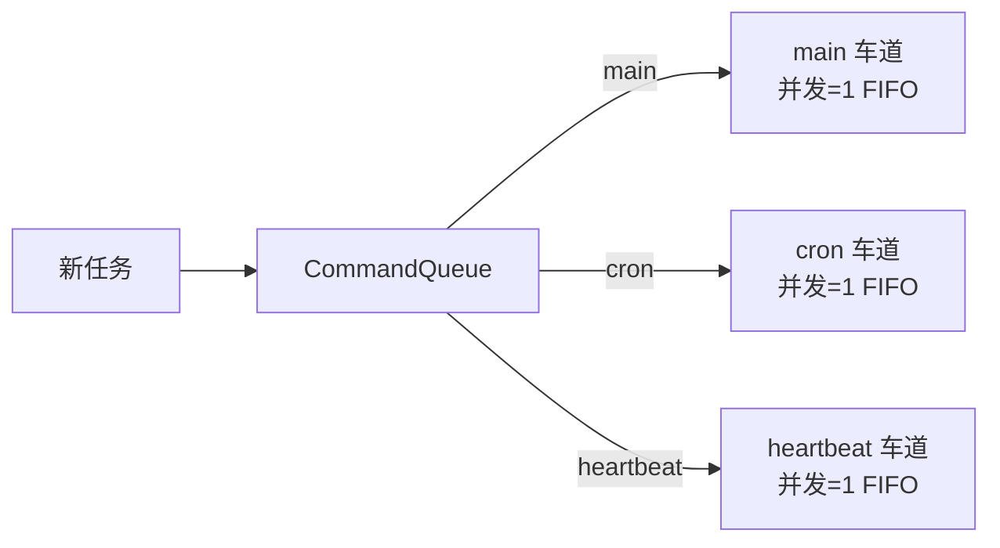
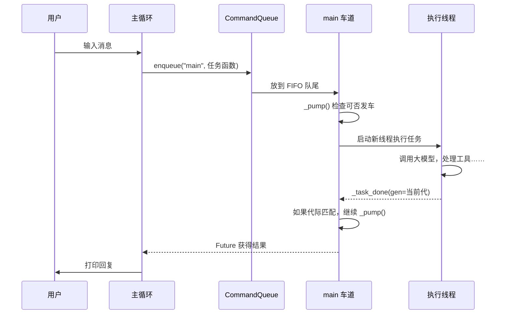

# Chapter 10: 并发处理

在[第 9 章：弹性与容错](09_弹性与容错.md)中，我们学会了如何让代理在失败时自己站起来。现在代理已经能应付断网、限流、密钥失效……但它还有一个隐藏的小问题：**同时只能专心做一件事**。如果用户正在问问题，后头的心跳任务突然也想借用代理的大脑，就会发生“撞车”——两个请求同时往大模型 API 里灌，轻则互相干扰，重则一起报错。

本章要介绍的**并发处理**，就是为代理系统设计一套“行车调度系统”。我们用**命名通道（Lane）** 把任务分成独立的车道，每条车道有自己的排队规则、最高并发数和启动条件。不管是用户的对话、每分钟一次的 Cron 提醒，还是每小时跳一下的心跳检查，都能各走各的道，互不阻塞，也不会出现“一辆车卡死整条路”的情况。

读完这一章，你将拥有一个**安全、有序的多任务并跑系统**，它能在同一时间处理来自不同来源的消息，却永远井井有条。

---

## 从一个“多事之秋”的早上说起

想象你的代理 Luna 正在处理一个复杂任务。你在终端里对它说：

```
You > 帮我分析一下昨天所有用户的操作日志，生成一份报告。
```

Luna 开始干活了。它先读取日志文件，再调用大模型推断……这个过程可能需要好几秒钟。

就在它埋头苦干的时候，后台闹钟响了：Cron 服务说“现在是早上 9 点，该执行每日摘要了”。同时，心跳线程也觉得“我已经闲了 30 分钟，该检查一下有没有新待办了”。

如果这三个请求同时冲向大模型，会发生什么？

- Luna 可能会突然分心，回答出牛头不对马嘴的东西。  
- 或者 API 收到三个并发请求，超过了限流配额，全部被拒。  
- 更糟糕的是，你正在等的结果被心跳的输出“插队”了，终端上乱成一团。

我们需要一个“红绿灯”，让用户的任务永远优先，让后台任务等一等，让不同任务各有各的排队区。**并发处理的灵魂就是：每个人走自己的道，关键的道永远绿灯。**

---

## 核心概念：像高速公路一样管理并发

现实中，高速公路把车道分得很清楚：最左是快车道，中间是行车道，最右是应急车道。在 `claw0` 里，我们用三样东西来实现这种管理：

| 组件 | 职责 | 公路比喻 |
|------|------|----------|
| **LaneQueue（车道队列）** | 一条“车道”，拥有自己的 FIFO 排队区、最大并发车数、以及红绿灯控制 | 一条独立的公路，有它自己的入口排队区 |
| **CommandQueue（调度中心）** | 根据任务类型，把车引导到正确的车道上 | 高速公路入口的电子指示牌 |
| **代际追踪（generation）** | 防止重启后“幽灵车”重新上路 | 每次发车时贴上“批次标签”，重启后旧批次的车辆自动失效 |

它们的配合关系可以画成这样：



不论是用户在终端敲的字，还是后台闹钟要跑的提醒，只要进入对应的车道，就会按顺序排队、逐个执行。每条车道还能独立设置**最大并发数**——比如将来你想让 `research` 车道同时跑 3 个分析任务，动一下配置就行。

---

## 三块积木，搭出“不撞车”的调度器

下面我们一块一块地认识它们。

### 1. `LaneQueue`：一条车道

每条车道都是一个 `FIFO` 的先进先出队列，就像高速公路入口的排队区。它有三个关键属性：

- **`max_concurrency`**：这条车道最多同时跑几辆车（默认 1，也就是一次一辆）。
- **`_active_count`**：当前有多少辆车正在跑。
- **`_condition`**：`threading.Condition` 对象，充当红绿灯，让车辆在排队时可以睡觉，而不是空转浪费 CPU。

当我们把任务“放上车道”时，它并不是立刻就跑。如果当前车道已经有车在跑（`_active_count >= max_concurrency`），新任务就乖乖在队列里等着。等前面的车跑完，红绿灯变绿，它才能动。

```python
class LaneQueue:
    def __init__(self, name, max_concurrency=1):
        self.name = name
        self.max_concurrency = max(max_concurrency, 1)
        self._deque = deque()                # FIFO 队列
        self._condition = threading.Condition()
        self._active_count = 0
        self._generation = 0
```

> **比喻时间**：这就像高速公路收费站。每个收费口（车道）一次只能处理一辆车（默认并发=1）。如果前面的车还没走，后面的车就排队等着。`_condition` 就是收费员的信号旗。

### 2. `CommandQueue`：高速公路调度中心

`CommandQueue` 不自己干活，它的工作是把每个任务塞进正确的车道里。比如用户消息一律进 `main` 车道，定时任务一律进 `cron` 车道，心跳进 `heartbeat` 车道。

```python
class CommandQueue:
    def __init__(self):
        self._lanes = {}        # 名字 → LaneQueue

    def enqueue(self, lane_name, fn):
        lane = self._lanes.get(lane_name)
        if not lane:
            lane = LaneQueue(lane_name)      # 车道不存在就新建一条
            self._lanes[lane_name] = lane
        return lane.enqueue(fn)
```

`enqueue()` 返回一个 `Future` 对象，调用者可以在未来阻塞等待结果，也可以注册回调函数。这使得整个并发模型和 Python 的 `concurrent.futures` 生态无缝对接。

### 3. 代际追踪：防止“幽灵车”上路

这个功能稍微抽象一点，但非常巧妙。想象一下：程序正常运行中，心跳线程跑了一半，突然系统重启了。重启后，旧的任务可能还在后台的某个线程里挣扎，等它终于跑完想“挥手让下一辆车走”，却发现系统已经重生了——如果继续挥手，新系统可能会莫名其妙地多跑一个任务。

所以 `LaneQueue` 给每一次“运行周期”分配了一个**代际编号**（`_generation`）。重启时调用 `reset_all()`，所有车道的代际都 +1。旧的任务完成后会检查自己的代际：

```python
def _task_done(self, gen):
    with self._condition:
        self._active_count -= 1
        if gen == self._generation:
            self._pump()           # 当前代：正常调度下一辆
        else:
            pass                   # 旧代：不理你，安静消失
        self._condition.notify_all()
```

这就像给每辆车发了一张“批次标签”。重启后，旧批次的标签过期了，哪怕车还勉强跑到终点，调度员也不会让它再放行下一辆车。

---

## 使用并发处理解决早晨的“撞车”场景

现在我们回到 Luna 的早晨。有了并发处理，系统会这样运作：

1. **用户的“分析日志”请求**进入 `main` 车道，Luna 开始专心处理。
2. 9:00，Cron 服务想运行“每日摘要”。它把摘要请求塞进 `cron` 车道。`cron` 车道有自己的调度员，不会去抢 `main` 车道的路。由于它也是并发=1，如果上一个 cron 任务还在跑，新任务就排队。
3. 同时，心跳线程也触发了。它会先看一眼 `heartbeat` 车道：“现在有车在跑吗？有的话我就不凑热闹了。” 这样心跳绝不会和用户请求或定时任务打架。

最终，用户得到流畅的回复，Cron 和心跳也在各自的车道里安安稳稳地跑完，互不影响。

---

## 动手试试：感受并发调度的魅力

启动示例：

```bash
python en/s10_concurrency.py
```

你会看到启动信息列出了三条默认车道：

```
  Lanes: main, cron, heartbeat
  Heartbeat: on (1800s)
  Cron jobs: 1
```

### 1. 查看车道状况

用 `/lanes` 命令看一眼调度面板：

```
You > /lanes
  main          active=[.]  queued=0  max=1  gen=0
  cron          active=[.]  queued=0  max=1  gen=0
  heartbeat     active=[.]  queued=0  max=1  gen=0
```

`active=[.]` 表示当前有 0 辆车在跑，`.` 代表空位，`*` 代表有任务。三车道都空闲，一切都静悄悄的。

### 2. 手动向车道塞任务

用 `/enqueue` 命令把任务扔进指定的车道：

```
You > /enqueue research 请用一句话总结人工智能的发展历史。

  Enqueueing into 'research': 请用一句话总结人工智能的发展历史。
  [research] result: 人工智能经历了从符号推理到机器学习，再到深度学习和大型语言模型的多阶段进化。
```

因为 `research` 车道之前不存在，系统自动创建了它，`max_concurrency` 默认为 1。任务跑完后，你可以再用 `/lanes` 看 `research` 车道已经加入。

### 3. 改变车道并发数

假设你想让 `research` 车道能同时跑 3 个分析任务：

```
You > /concurrency research 3
  research: max_concurrency 1 -> 3
```

现在再看车道：

```
You > /lanes
  research      active=[...]  queued=0  max=3  gen=0
```

方括号里的点变成了三个（`[...]`），表示最多容纳 3 个并发任务。

### 4. 模拟重启：代际追踪展示

用 `/generation` 查看当前代际：

```
You > /generation
  main: generation=0
  cron: generation=0
  heartbeat: generation=0
  research: generation=0
```

现在输入 `/reset`，模拟一次系统重启：

```
You > /reset
  Generation incremented on all lanes:
    main: generation -> 1
    cron: generation -> 1
    heartbeat: generation -> 1
    research: generation -> 1
  Stale tasks from the old generation will be ignored.
```

所有车道的代际都 +1 了。如果此时有上一代遗留的僵尸任务跑完，它们不会再次触发调度。

---

## 深入内部：一条任务是怎么样被“车接车送”的？

用一张简单的序列图，追踪一个用户消息从输入到回复的全过程：



整个过程里，后台的 `cron` 和 `heartbeat` 车道也各自独立运转，它们和 `main` 车道唯一的关联就是共享同一个大模型 API。但每一秒，每条车道只允许自己设定数量的任务同时在跑，不会互相踩脚。

---

## 关键代码拆解：`_pump()` 是怎么当交通警察的？

`_pump()` 是并发调度的灵魂函数。它只在持有 `_condition` 锁的情况下被调用，确保任何时刻只有一个人在操作队列。

```python
def _pump(self):
    while self._active_count < self.max_concurrency and self._deque:
        fn, future, gen = self._deque.popleft()   # 从队首取车
        self._active_count += 1
        threading.Thread(target=self._run_task, 
                         args=(fn, future, gen), daemon=True).start()
```

翻译一下：

- 只要“当前正在跑的车数量”小于“最大并发数”，并且“队里还有车在等”，就继续发车。
- 每取出一辆车，`_active_count` 加 1，然后把它包装进一个新线程里开跑。
- 跑完之后，它会回到 `_task_done()`，把 `_active_count` 减 1，再喊一声 `_pump()`，看看后面还有没有车可以走。

整个过程中不需要外部调度器（没有 `while True` 轮询），全靠 `Condition` 的通知机制，几乎没有 CPU 浪费。

---

## 心跳和 Cron 是怎么变成“车道友好”的？

在上一章里，心跳用了一个简单的 `threading.Lock()` 来避免撞车。本章升级后，心跳不再关心底层锁，而是**通过查看车道状态**来决定是否运行：

```python
def heartbeat_tick(self):
    ok, reason = self.should_run()
    if not ok:
        return

    lane = self.command_queue.get_or_create_lane("heartbeat")
    if lane.stats()["active"] > 0:     # 车道正忙，跳过本轮
        return

    future = self.command_queue.enqueue("heartbeat", _do_heartbeat)
```

Cron 的逻辑几乎一模一样：检查 `cron` 车道是否忙碌，忙就跳过。这比锁更清晰——你一眼就能看出是哪个车道在保护什么任务。

---

## 本章小结

恭喜你！现在你的代理系统有了井井有条的“交通指挥中心”。我们学到了：

- **命名车道（LaneQueue）** 把不同种类的任务隔离到独立的 FIFO 队列里，每个队列有独立的并发上限。
- **调度中心（CommandQueue）** 负责把任务路由到正确车道上，并在需要时自动创建新车。
- **代际追踪（generation）** 让系统重启后，旧时代的“幽灵任务”不会再骚扰新时代的队列。
- **心跳和 C ran** 通过与车道状态互动，实现了非阻塞的“有空就跑”策略，完全不会挤占用户的通道。

你的代理现在能同时处理用户对话、定时提醒、自我检查，而且永远保持秩序。它已经从一个单线程助手变成了一个真正的并发智能体平台。继续探索，你可以结合[多代理路由](06_多代理路由与管理.md)让不同代理共享车道，或者用[消息投递](07_消息投递.md)把并发产生的回复安全地发出去。

你已经掌握了构建生产级 AI 助手的所有核心组件。祝贺你，claw0 之旅到这里就完整了！

---

Generated by [AI Codebase Knowledge Builder](https://github.com/The-Pocket/Tutorial-Codebase-Knowledge)