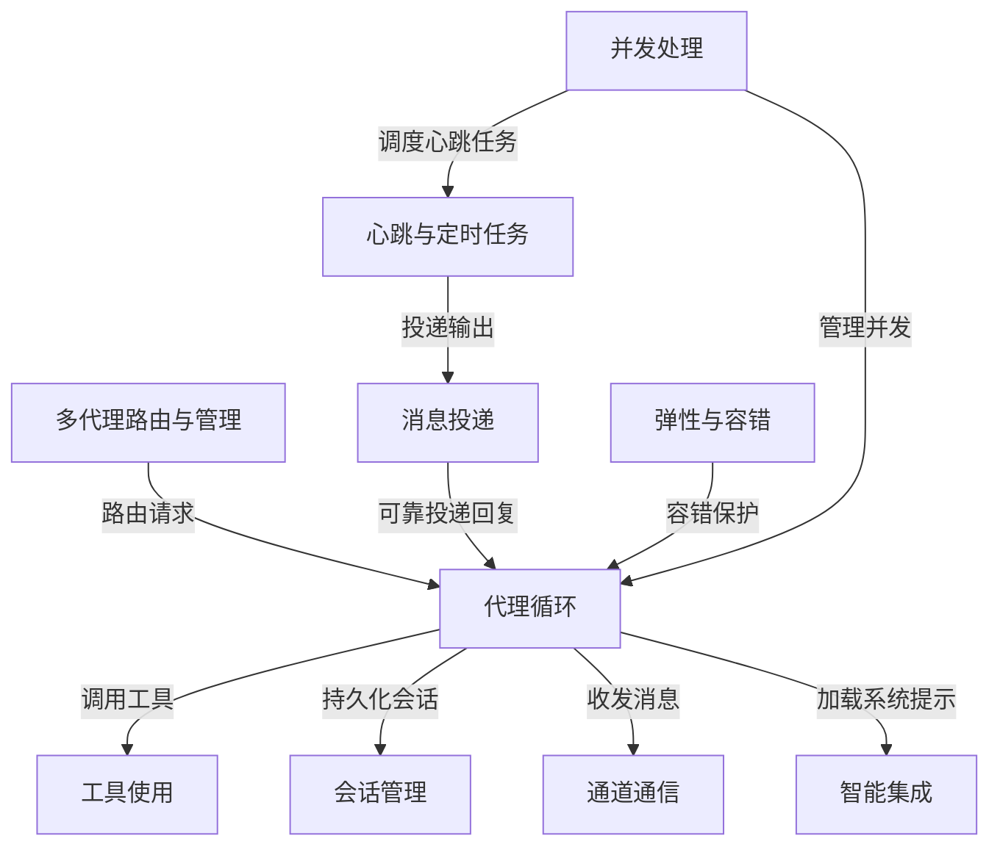

# Tutorial: claw0

claw0 是一个**模块化AI代理框架**，通过*分层扩展*的方式从简单对话循环逐步构建出完整的智能代理系统。
它以**代理循环**为核心，依次集成*工具调用*、*会话持久化*、*多通道通信*、*路由与多代理管理*、
*动态系统提示和记忆检索*、*心跳与定时任务*、*可靠消息投递*、*多层容错重试*以及*并发任务管理*等特性，
最终形成一个既能与用户交互又能自主执行后台工作的稳健代理平台。

**Source Repository:** [None](None)

## Chapters

1. [代理循环](01_代理循环.md)
2. [工具使用](02_工具使用.md)
3. [会话管理](03_会话管理.md)
4. [通道通信](04_通道通信.md)
5. [智能集成](05_智能集成.md)
6. [多代理路由与管理](06_多代理路由与管理.md)
7. [消息投递](07_消息投递.md)
8. [心跳与定时任务](08_心跳与定时任务.md)
9. [弹性与容错](09_弹性与容错.md)
10. [并发处理](10_并发处理.md)

---

Generated by [AI Codebase Knowledge Builder](https://github.com/The-Pocket/Tutorial-Codebase-Knowledge)